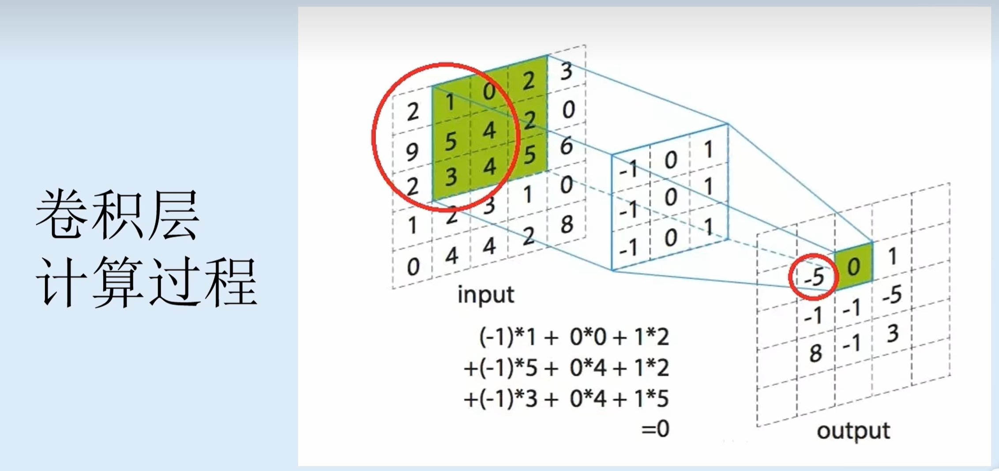
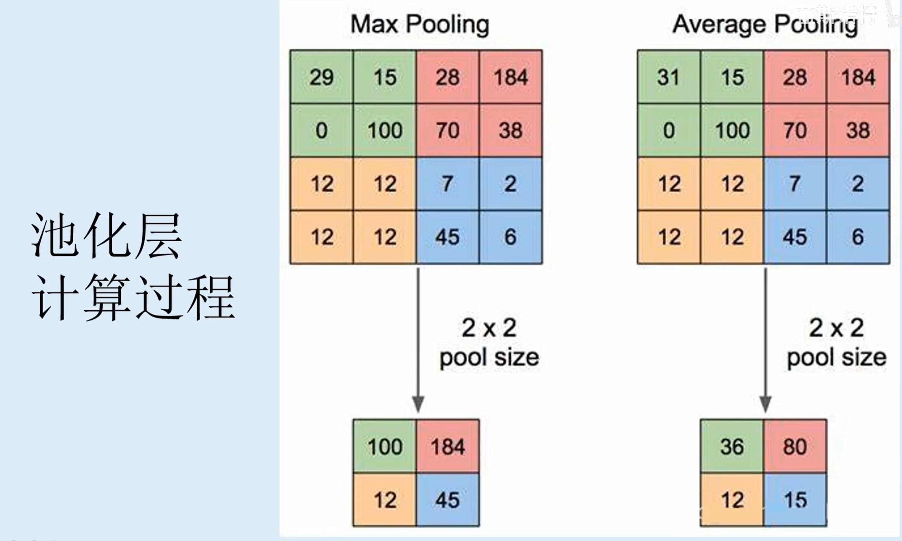
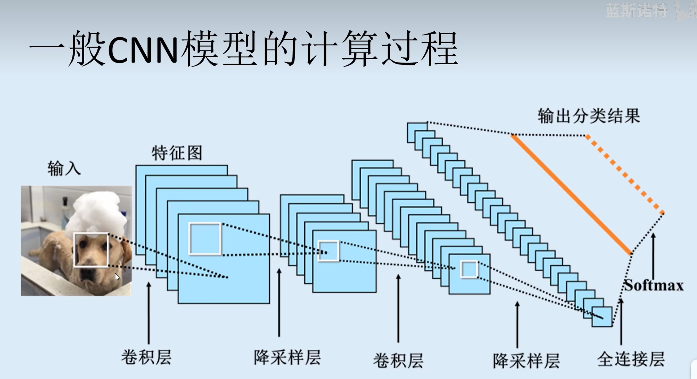

# 卷积神经网络（CNN）

- 作用
  
  - 是一种主要用于图像识别和计算机视觉任务的人工神经网络模型。它是深度学习领域最重要和最常用的网络之一。

- 原理
  
  - CNN 的核心思想是通过**卷积层**、**池化层**和**全连接层**等组件，自动学习数据中的特征，并用于分类、识别和分割等任务。

- 术语
  
  - 卷积层（Convolutional Layer）：卷积层是 CNN 的核心，通过在输入数据上滑动一个或多个卷积核（kernal），提取局部特征。每个卷积核生成一个特征图，将输入数据中的局部特征进行卷积运算，以捕捉空间结构信息。stride:步长
  - 池化层（Pooling Layer）：池化层用于减小特征图的空间尺寸，降低数据量和计算复杂度。常用的池化操作有最大池化和平均池化，它们通过在特定区域内选择最大值或平均值来减少特征的维度。
  - 全连接层（Fully Connected Layer）：全连接层将池化层的输出展平为一维向量，并通过多个全连接层进行分类、回归或其他任务。全连接层将学习到的特征进行组合和处理，最终输出结果。
  - 激活函数（Activation Function）：在神经网络中，激活函数引入非线性变换，使得网络可以学习更复杂的模式和特征。常用的激活函数有ReLU、Sigmoid、Tanh等。

- 总结
  
  - 二维数据抽取成为一维向量
  - CNN 的训练过程通常使用反向传播算法和梯度下降优化方法进行权重更新。在大规模数据集上进行训练，CNN 可以自动学习到图像中的特征，如边缘、纹理和形状等，并在测试阶段对未见过的图像进行准确的识别和分类。具有广泛的应用领域，包括图像分类、目标检测、人脸识别、语义分割等。

