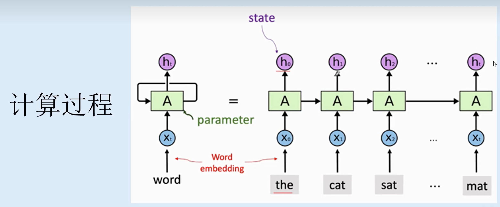

# 循环神经网络（RNN）

- 特点

  - 根据"人的认知是基于过往的经验和记忆"这一观点提出，RNN内部具有很强的记忆性，它可以利用内部的记忆来处理任意时序的输入序列。
  - 一个序列当前的输出与前面的输出也有关。具体的表现形式为网络会对前面的信息进行记忆并应用于当前输出的计算中，即隐藏层的输入不仅包括输入层的输出还包括上一时刻隐藏层的输出。
- 作用

  - RNN在自然语言处理、语音识别、时间序列预测等领域广泛应用。它能够有效处理时序数据，并对过去的信息进行编码和学习，具备一定的记忆能力。

