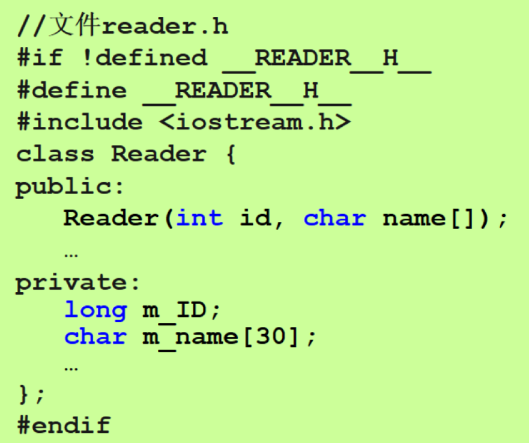

# 第二章 数据类型、运算符与表达式

## 2.2 基本数据类型

- 整型
  
  - 短整型
    
    - `short`
    
    - `unsigned short`
  
  - 整型
    
    - `int`
    
    - `unsigned int`
  
  - 长整型
    
    - `long`
    
    - `unsigned long`

- 浮点型
  
  - `float` < `double` < `long double`

- 字符型
  
  - `char`
  
  - `unsigned char`
  
  - 表示单个字符：`'a'`
  
  - 当成整型运算

- 布尔型
  
  - 对任意非零数→1/True
    
    

## 2.3 变量与常量

- 符号常量
  
  - 例如`#define PRICE 15`
  
  - 在后续程序中使用15替代PRICE
  
  - 函数形参名不能与宏定义名相同
    
    
  
  ```c++
  #define PRICE 15+15
  #include <iostream.h>
  int main()
  {
    cout<<PRICE<<'\n';  //30,注意要计算
    cout<<PRICE*2<<'\n';    //45,由于PRICE定义时没有加括号，注意运算顺序
    return 0;
  }
  ```

- 编码风格：驼峰命名法
  
  - 第一个单词全小写，后续单词首字母大写
  
  - 如：`time   averageScore  theTotalNum`
    
    

## 2.4 类型转换

- 隐式类型转换
  
  - 算术表达式
    
    - 不同类型的数据，转换成精度最高、占用内存最多的那个数据类型
  
  - 赋值表达式
    
    - 自动将赋值运算符右边表达式的值转换成左边变量的类型（可能丢失数据精度）
      
      

## 2.5 运算符与表达式

- 求余运算(%)
  
  - 只能用于整数
  
  - 结果符号与被除数相同

- 位运算
  
  - 位逻辑运算，包括： 按位与`&`、按位或`|` 、按位取反`~` 以及位异或`^`
  
  - 移位操作，包括：向左移位`<<` 、向右移位`>>`
  
  - 逻辑移位是对无符号数进行的
  
  - 算术移位是对有符号数进行的，符号位不变，对数值位移动

- 逗号运算
  
  - 其值为所有逗号表达式中最右边的值

- 条件选择运算
  
  - **三元运算符**`<表达式1> ? <表达式2> : <表达式3>`
  
  - 先计算 <表达式1> 的值，如果其值为真（非0），那么整个表达式的值为 <表达式2> 的值；否则，整个表达式的值为 <表达式3> 的值

# 第四章 控制结构

## 4.2表达式语句

- 多重赋值语句
  
  - `x=y=z=0;`

## 4.4选择结构

- if
  
  - `if(<条件表达式>)<语句>;`
  
  - 所有表达式均可作条件表达式，关键在其bool值，非零为True，执行
  
  - 空语句`;` 类似于Python的`pass`

- if-else
  
  - else分支总是与前面最近的一个if语句匹配
  
  - `else if` 类似于Python的`elif`

- switch
  
  ```c++
  switch(<条件表达式>)
  {
      case <常量表达式1>:
          <语句序列1>;
      ······
      case <常量表达式n>:
          <语句序列n>;
      default: 
          <语句序列n+1>;
  }
  ```
  
  - 条件表达式：值为整型（char、short、int、long 、long long）
  
  - 常量表达式：为整型常量，后跟`:` **不能包含变量和函数调用**
  
  - 语句序列块不用使用`{}`，但`switch`后要用；且可以不写语句序列块
  
  - **若不使用`break;`则程序会自进入的那个`case`开始，一直执行到结束（包括`default`的语句）**

## 4.5循环结构

- while
  
  ```c++
  //用while循环输出26个小写字母
  char x='a';
  while (x<='z')
  {
    cout << x <<endl;
    x+=1;
  }
  ```

- do-while
  
  ```c++
  char x='a';
  do
  {
    cout << x <<endl;
    x+=1;
  }while(x<='z');    //别忘了最后的分号
  ```

## 4.6控制转移语句

- break
  
  ```c++
  bool isPrime=true
  for(int i=2;i<=n/2;i++)
  {
    if(n%i==0)
      {
          isPrime=false;
          break;
      }
  }
  ```

- continue
  
  - 在while/do-while结构中，遇到continue会结束本次循环，转去测试<条件语句>
  
  - 在for循环中，遇到continue会先执行<增量语句>，而后转去测试<条件语句>

- goto
  
  ```c++
  if(a>=3)
      goto add;
  a++;
  add:b=a+2;
  ```

# 第五章 函数

## 5.3 函数的定义与函数原型

- 函数定义
  
  ```c++
  <返回值类型><函数名>(<参数列表>)
  <函数体>
  ```

- <返回值类型>
  
  - 可以为任意数据类型
    
    - 缺省类型：`int`
    
    - 若无返回值，使用关键字`void`说明

- <参数列表>
  
  - 每个参数包括两部分信息：数据类型和参数名称
  
  - 这里的参数叫形参（发生函数调用时的参数，叫实参）
  
  - 可以为空，但参数列表外的`()`不能省略

- 函数体内不能定义或声明另外一个函数
  
  - 所有的函数的定义都是并列在一个层次的

- 函数名不是变量，不能够被赋值

- 函数原型
  
  ```c++
  <返回值类型><函数名>(<参数列表>);
  // 参数列表中不必给出参数的名称，只需要给出其数据类型
  ```

## 5.4 函数的调用

- 函数调用
  
  ```c++
  <函数名>(<实在参数列表>);
  ```

- 传引用调用
  
  ```c++
  void swap(int &x, int &y)
  {
      int z = x;
      x = y;
      y = z;
  }
  
  //在调用上述函数的时候不用&
  ```
  
  - 优势：不仅可将数据从调用函数传递到被调用函数，还能通过形式参数访问调用函数的实参变量，实现信息从被调用函数传向调用函数：当被调用函数工作完毕返回时， 实参单元就有了所期望的值
  
  - 劣势：损坏模块的独立性,容易出错
  
  - 应用：有多个返回值

- 默认参数必须是函数参数表中最右边的参数
  
  - 个数可为1个、多个或全部

## 5.5 函数重载

- 这些函数有不同的参数（参数的个数、类型或顺序不同），返回值也可以不同

- 调用重载函数时，编译器通过检查实在参数的个数、类型和顺序来确定相应的被调用函数

- 重载函数内部的执行逻辑是可以不同的，关键在于**相同的函数名**和**不同的形参**


## 5.8 递归函数

- 在递归调用以后执行的语句,后进先出
  
  - 如果想跟递归调用的顺序一致进行打印，就在递归调用**之前**cout（下图右87654321）
  
  - 如果想跟递归调用的顺序相反进行打印，就在递归调用**之后**cout（下图左12345678）
  
  

- 汉诺塔问题
  
  ```c++
  #include<iostream>
  using namespace std;
  
  void hanoi(int n,char s,char d,char m,int &sum);
  /*
  s 源针
  d 目的针
  m 辅助针
  */
  int main()
  {
       int n;
      char s='A',d='B',m='C';
       cin>>n;
       int sum=0;
       hanoi(n,s,d,m,sum);
       cout <<"一共需要："<< sum << "次";
      return 0;
  }
  void hanoi(int n,char s,char d,char m,int &sum)
  {
      if(n==1) 
      {
          sum++;
           cout << n <<":" << s << "->" << d << endl ;
      }
      else
      {    
          //把n-1个盘子从s移到m，借助d
          hanoi(n-1,s,m,d,sum);
          //第n个铁盘从s移到d
          sum++;
          cout << n <<":" << s << "->" << d << endl ;    
           //把n-1个盘子从m移到d，借助s
          hanoi(n-1,m,d,s,sum);     
      }
  }
  ```

## 5.9 预处理指令

- `#include`
  指示编译器将该命令所指出的另一文件嵌入至当前文件中
  
  - `#include <文件名>` 从系统指定的头文件目录中搜索
  
  - `#include "文件名"` 从当前工程所在目录中搜索 （自己写的头文件，里面有自己定义的函数）

- `#define`
  
  - `#define <常量标识符> <常量>` 符号常量
    
    - `#define PI 3.1415926`
  
  - `#define <宏标识符> <字符串>` 宏
    
    - `#define CIRCLE_AREA (x) (PI*(x)*(x))`

# 第六章 数组

## 6.1 一维数组

- 一维数组的声明
  
  - `<元素类型> <数组名>[<元素数目>];`
  
  - `int a[10];`
  
  - 数组元素在内存中**按顺序存放**，且每个元素占据相同大小空间
  
  - **注意：声明数组的<元素数目>必须是常量**

- 数组的地址
  
  - 下面两行等价，**直接访问数组名得到的是首元素的地址**（而不是首元素的值）
    `cout<< "The address of A is " << A << endl;`
    `cout<< "The address of A[0] is " << &A[0] << endl;`

- 数组的大小
  
  - sizeof
    
    - 参数：数据类型、变量、数组等
    
    - 返回结果：参数所占存储空间的字节数

- 数组越界
  
  - **C++不做越界检查，越界的数据不可控制**
  
  - 数组元素访问的过程：首先计算该元素的地址，再按对应类型访问该地址中数据
  
  - **数组访问越界后，仍会遵循同样的规则访问数据，只是数据是我们不想要的**

- 数组的初始化
  
  - 在声明数组的同时，为数组元素赋初值
  
  - 在声明数组a的同时进行了初始化（整体初始化也只能在声明的时候初始化）
    
    ```c++
    //正确
    int a[4]={1,3,5,7};
    //错误
    int a[5];
    a={1,2,3}; 
    ```

- 初始化的缺省值
  
  - **初始值的数目小于数组元素的数目，剩余元素初始化为0；**超过会报错
  
  - 声明数组时省略元素的数目，那么系统将根据初始值的数目来确定数组元素数目
    `int a[]={1,2,3,4,5};`

- 直接选择排序法
  
  - 循环`N-1`轮`(i:0~N-2)`，将较小的元素放到前面
  
  - 每一轮，将`a[i]` 后面的所有元素依次与`a[min]`（初始值为`a[i]`）比较，如果`a[j]<a[min]`，则`min=j`
  
  - 一轮遍历结束后，如果`min!=i`，则将`a[i]`与`a[min]`交换
    
    ```c++
    #include<iostream>
    using namespace std;
    int main()
    {
        int a[]={5,6,9,2,5,1,0,3,6};
        int n=sizeof(a)/4;
        for(int i=0;i<n-1;i++)
        {
            int min=i;
            for(int j=i+1;j<n;j++)
            {
                if(a[j]<a[min])
                    min=j;                           
            }
            if(min!=i)
            {
                   int x=a[i];
                   a[i]=a[min];
                   a[min]=x;
            }
        }
        for(int k=0;k<n;k++)
            cout << a[k] << '\t';
        return 0;
    }
    ```

- 使用数组作为函数参数时注意的问题
  
  - 本质是将数组的地址传递给了被调用函数。因此，可以实现与传引用类似的功能，即**函数直接修改数组元素的值**
  
  - 在函数声明、定义和调用时，都只需要提供数组的名称，而不需要告诉编译器数组的长度。编译器会将数组形参视为指针，其长度信息在函数调用时并不重要
  
  - **调用**时，实参传入一个数组名，例如`a`
  
  - **关于元素数目**（防止越界）
    
    - 数组作为函数参数传递时会退化为指针类型，所以在函数中不能直接使用`sizeof`操作符求得数组的长度
    
    - 如果需要在函数内部确定数组的长度，可以通过以下两种方式：
      
      1. 将数组的长度在`main`函数中用`sizeof`等方法求出，然后作为单独的参数传递给函数
      
      2. 在函数中手动遍历数组元素来计算数组的长度（需要在数组末尾有标记元素）

- 用二分法查找数组元素（典型递归问题）
  
  - 首先要求数组元素已经按从小到大顺序进行排列
  
  - 把关键值`key`和数组中央的元素（下标为`middle`）进行比较，假定数组名为`a`
    
    - 如果相等，则找到该元素
    
    - 如果`key<a[middle]`，则在数组的前一半的元素中进行二分查找
    
    - 反之则在数组的后一半的元素中进行二分查找
  
  ```c++
  #include <iostream>
  using namespace std;
  
  int binarySearch(int b[],int searchKey,int low,int high);
  
  int main()
  {
      int a[]={1,3,5,7,9,11,12};
      int n=sizeof(a)/4;
      int index=binarySearch(a,11,0,n-1); 
      if(index==-1)
           cout << "Not Found!" << endl;
       else 
           cout << "Found:" << index << endl;
      return 0;
  }
  
  int binarySearch(int b[],int searchKey,int low,int high)
  {
      if(low>high)
          return -1;  //递归终止条件
      int middle=(low+high)/2;
      if (searchKey==b[middle])
          return middle;
      else if (searchKey<b[middle])
          return binarySearch(b,searchKey,low,middle-1);  //函数存在返回值，需要用return
      else
          return binarySearch(b,searchKey,middle+1,high); 
  }
  ```

## 6.2 多维数组

- 多维数组的声明
  
  - 声明一个二维数组需要两个下标
    `<元素类型><数组名>[<第一维数目>][<第二维数目>]；`
    `int A[3][4];`

- 二维数组的存放
  
  - 多维数组在内存中按行存放，越靠后的下标先变化，越靠前的下标后变化

- 多维数组的初始化
  
  - 全部初始化只能在声明的同时进行**（元素个数只能省略第一维）**
  
  - 数组初始化时，可用多重括号，但每个括号内元素的数目不应多于对应维度元素的数目
  
  - 初始值如果没有用花括号进行分组，编译器会自动地按存放顺序进行赋值
    
    

## 6.3 字符串

- 字符串的存储
  
  - 以`'\0'`结尾

- 字符串数组的初始化
  

- 字符串数组的输入与输出（与其余类型数组不同）
  
  - 使用`cin`直接输入，输入的字符串的位数要小于等于`数组元素个数-1`（即至少留一位给`'\0'`）；否则，会将数组后的内存单元数据覆盖
  
  - 通过字符数组名直接`cout`输出字符串时，仅输出到第一个`'\0'`

- 二维字符串数组的初始化
  
  
  - week的内部储存（存在内存浪费）
    

# 第七章 指针

## 7.1 指针的定义与声明

- 指针是一种特殊的变量，它的“值”是另外一个变量的“地址”

- **通过变量名是直接访问，通过指针是间接访问变量**

- 一种指针变量所指向的变量类型必须是固定的（不知道类型的话就不知道要取几个字节，也就无法确定指向的值）

- 不管指针指向的类型如何，指针变量本身一定占**四个字节**

- 指针变量的声明
  
  - `<类型名> *<标识符>`
    
    ```c++
    #include <iostream.h>
    int main()
    {
        int i,*p; ∥声明了整型指针变量p
        i=8;
        p=&i; ∥将i的地址赋给p
        cout<<*p<<"\t"<<p<< "\t" << &i <<"n"; //8   i的地址    i的地址
        return 0;
    }
    ```

- 空指针常量`NULL`或`nullptr`
  
  - 称为“空指针”，不指向任何值

## 7.2 指针的运算

- `*`运算符
  
  - 返回指针指向的对象
  
  - 如果使用下面的语句，则将p指向的变量的值赋为10 `*p=10;`
  
  - 注：声明时，*叫**指针描述符**；在表达式中，*是**间接引用运算符**

- `*`与`&`运算符
  
  - 二者的优先级相同，都是右结合的；互为逆运算
  
  - `*&p`与`&*p`等价，都为p（即某个变量的地址）

- 指针算术运算
  
  - `p±n`
    
    - 指针从当前位置向前或者向后移动n个数据单位；每个数据单位的大小为指针指向数据类型所占的字节数
  
  - `p1-p2`
    
    - 返回p1和p2之间的数据个数，而不是两个地址之差
  
  - `p1++、p1--、++p1、--p1`
    
    - 也是向前或者向后移动一个数据单位，而不是一个字节

## 7.3 指针与数组

- 指针与数组之间的关系
  
  - 数组名是指向数组第一个元素的常量指针
  
  - 若数组元素类型与指针指向的类型相同，则可以用数组对指针进行赋值
    
    - 赋值后，指针指向该数组中的第一个元素
    
    - 赋值后，通过指针可以访问数组中的全部元素
      
      ```c++
      char name[20],*pName;
      pName=name;
      ```


- 指针数组
  
  ```c++
  char *week[7]={"Sunday","Monday","Tuesday","Wednesday","Thursday","Friday","Saturday"};
  //数组的7个元素分别指向这七个常量字符串，常量字符串存放在内存中某个连续的区域，每个字符串结尾都有'\0'
  //其实week这个数组存放的只是七个指针，每个指针对应某个字符串中的第一个字符的地址
  //这种方法比二维数组存放字符串节省空间
  
  //访问和二维数组无异
  cout << week[2] << endl; //Tuesday
  ```

## 7.4 字符指针与字符数组

- 通过将指针指向数组首地址，二者可以相互转换，操作数组元素
  `char A[10]="abc"; char *p1=A;`

- C++对字符数组的输入输出提供了特殊的支持
  `cout<<字符数组名或字符指针`
  
  - 数组名或字符指针本质都是一个字符型地址
    `cout`将从该地址开始输出字符，直到`'\0'`
  
  - **重要：所以如果我定义指针`char c='A';char *p=&c;`，如果我想知道`c`的地址，即`p`的值，不能直接`cout << p;` ，因为它会输出`c`的值，直到遇到`\0`为止。但`c`是字符的话，本身是没有`\0`的，所以会一直向后访问，即会导致越界**
  
  - **必须要对指针进行强制类型转换`cout << (int *)p;`**

- 求字符串长度
  `int strlen (char*);`

- 字符串复制
  `char * strcpy (char* dest,char* src);`
  
  - 将字符串`src`的内容复制到`dest`中
  
  - 返回值为`dest`的值，即第一个字符的指针

- 字符串连接
  `char * strcat (char* dest,char* src);`
  
  - 将`src`连接在`dest`之后，返回`dest`的值
  
  - 需要确保`dest`有足够的空间存放新内容
  
  ```c++
  char str[20] = "Hello";
  char ch = '!';
  
  char ch_str[2];
  ch_str[0] = ch;
  ch_str[1] = '\0';
  
  strcat(str, ch_str);
  ```

- 字符串比较
  
  - 字符串的字典序
    
    - 从两个串的第一个字符起从前往后依次比较它们的ASCII码的值，直至遇到被比较的两个字符不同或者一个字符串结束
  
  - `int strcmp (char* s1,char* s2);`
  
  - 比较字符串s1和s2的字典序
    
    - 若`s1<s2`则返回小于0的值；
    
    - 若`s1==s2`则返回0；
    
    - 若`s1>s2`则返回大于0的值（字典序差值）

- **从字符串中查找字符**
  `char  * strchr (char * s,int c);`
  
  - 从`s`中查找第一个ASCII码为`c`的字符的位置
  
  - 与形参c对应的是整数，但通常是待查找的字符
  
  - 若成功，则返回该字符的存储地址；否则，返回NULL

- 从字符串逆序中查找字符
  `char  * strrchr (char * s,int c);`
  
  - 从`s`中查找最后一个ASCII码为`c`的字符的位置
  
  - 若成功，则返回该字符的存储地址；否则，返回NULL

- 从字符串中查找子串
  `char  * strstr (char *s1,char *s2);`
  
  - 从`s1`中查找子串`s2`第一次出现的位置
  
  - 若成功，则返回该字符串的存储地址；否则，返回NULL

- 返回逆序字符串
  `char * strrev(char *s);`

- 大写转小写、小写转大写
  `char * strlwr(char *s)`
  `char * strupr(char *s)`

- 字符串拆分
  **`char *strtok(char *str, const char *delim);`**
  
  - 将一个字符串按照指定的分隔符进行拆分（切割），可以将字符串切割为若干个子字符串，并返回第一个子字符串的指针。
  
  - `str` 表示要进行切割的字符串，`delim` 表示用于切割的分隔符。该函数返回切割后的第一个子字符串，并将一些静态变量存储起来以供下一次调用使用。
  
  - 对于同一个字符串，只能在第一次调用 `strtok` 时传入，之后的调用应当传入 `NULL`，表示继续上一次未完成的切割操作；否则，每次调用都会返回同一个子字符串。下面是一个使用 `strtok` 函数进行字符串切割的示例代码
    
    ```c++
    #include <iostream>
    #include <string.h>
    
    int main() {
        char str[] = "apple,banana,cat,dog,eagle";
        char *p;
        p = strtok(str, ",");   // 第一次调用，传入要切割的字符串
        while (p != NULL)
        {     // 只要返回值不为 NULL，就说明还有子字符串未被切割
            cout << p << endl;  // 输出当前子字符串
            p = strtok(NULL, ","); // 继续切割下一个子字符串，需要传入 NULL
        }
        return 0;
    }
    ```
  
  - 该代码中的 `str` 是待切割的字符串，使用 `,` 作为分隔符。在第一次调用 `strtok` 函数时，传入了要切割的字符串 `str`，函数会返回第一个子字符串 `"apple"` 的指针。然后使用 `while` 循环，每次调用 `strtok` 函数，继续切割下一个子字符串，直到函数返回 `NULL`，表示所有子字符串都已被切割完毕
  
  - 在使用 `strtok` 函数时，原字符串会被破坏，建议先备份原字符串

## 7.6 指针与引用

- 以指针为参数进行传递
  
  - 指针同样可以作为函数的参数进行传递
  
  - 函数形参的数据类型写成：T*
  
  - 传递实参时，应注意类型匹配
    
    ```c++
    int fun (int *);    //形参要求是int类型的指针
    int x,*p,a[10];     //那我传入的实参就必须是int类型的指针
    ···
    fun(&x);
    fun(p);
    fun(a);
    ···
    ```

## 7.7 动态分配内存

- C++的两种内存分配方式
  
  - 静态分配：通过变量声明实现，每声明一个变量，就为这个变量分配了空间
    `int i,j;
    float scores[100];`
  
  - 动态分配：在程序运行时按需为数据分配空间，如果程序使用的数据量很大而且可变时，可以高效的利用空间

- 动态分配应遵循4个步骤
  
  - 确定需要多少内存
  
  - 分配所需的内存
  
  - 使用指针指向获得的内存
  
  - **使用完后，及时释放内存，必须且只能释放一次，不可double free**

- 动态分配的函数
  
  - 标准库函数，如`malloc()`和`free()`
  
  - C++中新引入的`new`和`delete`运算符（更安全）

- `new`运算符
  
  - 声明指针变量后，需要对其进行初始化
    
    - 方法1：使用已有的存储空间，即将其赋值为某个变量的地址
      
      - `int *p,x; p=&x;`
    
    - 方法2：使用new运算符为其分配一个有效存储空间，并把首地址赋值给指针
      `<指针变量名>=new <数据类型>;`
      
      ```c++
      #include <iostream.h>
      int main()
      {
          int *p;
          cout<<p<<endl;  //使用new以前，其实也会给p分配一个地址，但可能无访问权限
          p=new int;  //保证这个地址有权访问
          cout<<p<<endl;
          *p=3;
          cout<<*p;
          delete p;
          return 0;
      }
      ```
  
  - 动态内存的申请
    
    - 可能不成功，此时返回`NULL`
    
    - 如果分配不成功而继续使用指针，则可能导致程序崩溃
    
    - 所以使用new分配存储空间以后，要判断是否成功，若失败则不可继续执行

- `delete`运算符
  
  - 动态内存的释放
    使用new运算符申请的内存单元，一旦使用完毕，应当使用delete运算符释放该内存
    `delete<指针变量名>;`
    
    - 使用delete操作符不会改变指针变量的值，只是让系统为其指向的内存单元打标记，允许对其重新分配

- `new`和`delete`的数组形式
  
  - 可以以数组形式分配/释放内存单元
    `<指针变量名>=new <数据类型>[<表达式>];`
    `delete []<指针变量名>;`
    
    - 其中，`<表达式>`为一整数，这里允许是变量
      
      

# 第八章 结构、联合、枚举

## 8.1 结构

- 结构优点
  
  - 将不同类型的信息聚合在一起
  
  - 成为一种新的、独立的复合数据类型
  
  - 每个数组元素的类型是结构

- 定义结构体
  
  - `struct  <结构名> {<成员列表>};`
    
    - `<成员列表>` 由若干个成员声明组成
      
      - `<成员类型> <成员名> ;`
  
  ```c++
  struct student
  {
      int num;              // 学号 
      char name[20];        // 姓名
      char sex;             // 性别
      float score;          // 成绩
      ···
  };                        //注意;不能省略！
  ```

- 声明结构变量
  
  - 直接声明
  
  ```c++
  struct student
  {
      int  num;
      char  name[20];
      char  sex;
      float score;
  } stud1, stud2;
  
  ```
  
  - 独立声明
  
  ```c++
  student stud3;
  student stud4;
  student stu[N];
  student *sptr;
  ```

- 结构可嵌套定义
  

- 初始化结构变量
  
  - 在声明时初始化结构变量
    
    - `student stu1 = {101, "James", 'M', {1996, 5, 4},  86.5};`
  
  - 不能直接使用结构实例对嵌套结构进行初始化
    
    ```c++
    date d = {1996, 5, 4};
    student stu1 = {101,"James", 'M', d, 86.5}; //d是一个结构实例，不能这样初始化
    ```

- 访问结构的成员
  
  - 点操作符 `.`
    
    - 和结构变量名一起使用
    
    - `stu1.name`
  
  - 箭头操作符`->`
    
    - 和结构指针名一起使用
    
    - `sptr->name`

- 结构变量在内存中的存放
  
  - 结构变量的大小
    大于或等于
    其各成员大小之和
  
  - 两条对齐原则
    
    1. 元素从结构体存储的首地址（为0）开始，每一个元素放置到内存中时，它都会认为内存是以它自己的大小来划分的（“假定一致性”），因此元素放置的位置会在自己长度的整数倍上开始
    
    2. 检查存储单元是否为所有元素中最长的元素的长度的整数倍，若不是，则补齐为它的整数倍。因此，移动位置会导致结构体空间的变化

## 8.2 结构的使用

- 结构与函数
  
  - 结构类型数据作为函数参数
  
  - 结构体／结构体指针作为函数返回值
    

- 结构与数组
  
  - 数组元素可以是结构体类型
  
  

- 结构与指针
  
  - 结构指针变量的声明
    
    - 结构指针变量：当一个指针变量指向一个结构时
    
    - `<结构名> * <结构指针变量名>;`
  
  - 通过结构指针变量访问成员
    
    - `(*<结构指针变量名>).<成员名>;` 括号不可省略
    
    - `<结构指针变量名> -><成员名>;`
  
  ```c++
  student * pStud , stud;  // 结构指针变量声明
  ... ...             
  pStud = &stud;        // 将结构变量的地址赋给指针，不要把结构名赋给指针变量，结构名是一种类型
  ... ...             
  cout << stud.num << endl;
  cout << pStud->num << endl;
  ... ...             
  
  ```
  
  

# 第九章 链表

## 9.1 链表的基本概念

- 链表节点是特殊的结构
  
  - 该结构中有一个指向本结构类型的指针字段（成员）
    
    ```c++
    struct node
    {
      int data;
      node * next;
    };
    ```
  
  - 使用链表结构可以有效克服静态数组的缺陷

## 9.2 单向链表

- 结构示意图
  

- 建立链表
  
  - 初始状态：`head=tail=NULL`
  
  - 执行若干步如下的操作：
    
    - 动态建立一个新节点；
    
    - 使用一个指针tmp指向这个节点；
    
    - 将其“挂在”链表末尾的位置：
    
    - 修改tail指针，将其指向tmp节点
  
  ```c++
  struct node
  {
      char name[10];
      int score;
      node * next;
  };
  
  int main()
  {
      const int N=3;
      node *head=NULL;
      node *tail=NULL;
      for(int i=0;i<N;i++)
      {
          node *tmp=new node;
          tmp->next=NULL;
          cin >> tmp->name >> tmp->score ;
          if(head==NULL)
          {
              head=tmp;
              tail=tmp;
          }
          else
          {
              tail->next=tmp;
              tail=tmp;
          }
      }
  ```

- 遍历链表
  
  - 声明一个临时指针变量`node *tmp`,并将其初始化为`head`
  
  - 执行`while`循环
  
  - 循环条件为`tmp!=NULL`
  
  ```c++
  node *tmp=head;
  while(tmp)
  {
      cout << tmp->name << '\t' << tmp->score << endl;
      tmp=tmp->next;
  }
  ```

- 读取/更新链表结点
  
  - 输出/更新链表中第m个结点的数据
  
  - 初始化：`tmp`指向`head`，同时使用临时变量n计数，初值为1
  
  - 遍历链表：执行循环，找第m个节点
    
    - `tmp &&(n<m)`
  
  - 若`tmp`不为`NULL`，输出/修改`tmp->data`
  
  ```c++
  node *tmp=head;
  int n=1;
  const int m=3;
  while(tmp && n<m)
  {
      tmp=tmp->next;
      n++;
  }
  if(tmp)
      tmp->score*=10;    //修改第三个节点（从1开始数）的成绩
  ```

- 链表中插入结点
  
  - 第一种情况：在链表的第m个结点的后面，插入一个新的结点，并且将其data字段设置为k
    
    - 移动临时指针tmp,使其指向第m个结点
    
    - 用`pnew`新建一个结点
    
    - 让`pnew`的next字段指向第m+1个结点
    
    - 让tmp的next字段赋为`pnew`
    
    - 若`tmp==tail`,则`tail=pnew`
    
    ```c++
    node *pnew=new node;
    cin >> pnew->name >> pnew->score ;
    pnew->next=tmp2->next;
    tmp2->next=pnew;
    if(tmp2==tail)
    {
        tail=pnew;
    }
    ```
  
  - 第二种情况：在第1个结点之前插入新的结点，将其data字段赋值为k,即将head指针指向新建立的结点
    
    - 使用临时指针变量pnew新建立一个结点，将其data字段赋为k
    
    - 若`head==NULL`,则将head和tail的值均赋为pnew
    
    - 若`head!=NULL`,则
      
      - `pnew->next=head;
        head=pnew;`

- 链表中删除结点
  
  - 第一种情况：链表非空，删除链表中的第m个结点后面那个节点，即第m+1个节点(m>0)
    
    - 移动临时指针tmp,使其指向第m个结点
    
    - 若`tmp->next`不为`NULL`,则执行以下操作
      
      - 令临时指针`del=tmp->next`
      
      - `tmp->next=del->next`
      
      - 若`del==tail`,则将tail赋为tmp
      
      - 释放del指向的结点
    
    ```c++
    if(tmp2->next)
    {
        node *del=tmp2->next;
        tmp2->next=del->next;
        if(del==tail)
        {
            tail=tmp2;
        }
        delete del;
    }
    ```
  
  - 第二种情况：删除第1个结点，即head指向的那个结点
    
    - 若`head=NULL`,则执行如下操作
      
      - 令临时指针`del=head`
      
      - 令`head=del->next`
      
      - 若此时`head==NULL`,则令`tail=NULL`
      
      - 删除del指向的结点

- 链表结构清空
  
  - 执行下面的 while 循环，循环条件`head !=NULL`
    
    - 令临时变量 `del = head`
    
    - 令 `head = head -> next`
    
    - 删除 `del` 指向的结点
  
  - 令 `tail = NULL`

- 链表排序
  
  - 只改变数据，也可以交换节点，但是操作复杂
  
  ```c++
  for(node* p_i = head; p_i->next; p_i = p_i->next)
  {
      node* p_k = p_i;
      for(node* p_j = p_i->next; p_j; p_j = p_j->next)
          if (p_j->data< p_k->data)
              p_k=p_j;
      int x = p_i->data;
      p_i->data = p_k->data;
      p_k->data = x;
  }
  ```

## 9.3 双向链表

- 建立双向链表
  
  - 新节点链入链尾
    
    - 原链尾节点的后继指针指向新节点
    
    - 新节点的前驱指针指向原链尾节点
    
    - 新节点(新链尾节点)的后继指针置为空指针
  
  - 将新节点链入链头
    
    - 原链头节点的前驱指针指向新节点
    
    - 新节点的后继指针指向原链头节点
    
    - 新节点(新链头节点)的前驱指针置为空指针

- 双向链表的遍历
  
  - 有链首节点，则可以沿着后继指针从头至尾遍历
  
  - 有链尾节点，则可以沿着前驱指针从尾向头遍历

- 在双向链表中插入和删除一个节点
  
  - 优点：获取插入节点或被删除节点的前驱和后继节点比较方便
  
  - 注意点：需要维护的指针较多

# 第十章 面向对象程序设计基本概念

## 10.1 类、对象和消息

- 类的定义
  
  
  - 三种权限（数据成员和成员函数）
    
    - `private`是私有数据，外部不可访问
    
    - `public`是公开函数，外部可以访问
    
    - `protected`受保护的，自己和子类可访问

```c++
#include<iostream>
#include<string.h>
using namespace std;

#define MODE1 1
#define MODE2 2
#define MODE3 3

class  CWashingMaching
{
private:
    double num;
    int type;
    bool begin;
public:
    CWashingMaching(double n)   //构造函数
    {
        num=n;
        type=0;
    }
    ~CWashingMaching()          //析构函数
    {}
    void setType(int x,bool b)
    {
        type=x;
        begin=b;
    }
    void showInfo()
    {
        cout << "你选择的洗衣模式是：" << type << endl;
        cout << "你设置的进水量是：" << num << endl;
        if(begin)
            cout << "现在开始洗衣" << endl;
    }
};


int main()
{
    CWashingMaching run_01(10.5),run_02(18);
    run_01.setType(MODE1,false);
    run_02.setType(MODE3,true);
    run_01.showInfo();
    run_02.showInfo();
    return 0;
}
```

# 第十一章 类与对象

## 11.1 类和对象的定义

- 成员函数的实现
  
  - 类的实现可以写在类里面，也可以写在类的外面
  
  - 写在类的外面时必须要用作用域运算符，表示该函数实现为类的成员函数
    `void Reader::BorrowBook (Book* book)`

- 数据初始化
  
  - 定义类时不能对数据成员进行初始化
  
  - 数据成员的初始化放在构造函数中

- 类的定义和实现一般放在不同的文件中
  
  - 类的定义一般放在一个头文件(Reader.h)中，供其它需要使用该类的文件包含
  
  - 类的实现一般放在一个源文件(Reader.cpp)中，该文件需要包含定义该类的头文件

- 为实现信息隐藏和最低访问权原则
  
  - 如果外部函数不需要访问某些数据，则不给它任何访问权限
  
  - 一些私有数据只有内部函数访问，完全没有公有函数可访问
  
  - 如果外部函数对数据只需要读，就只给它读的权限
    
    - `Circle(const circle& c1);`
  
  - 外部函数对数据的访问，必须通过公有函数接口，而不能直接访问数据成员
  
  - 如果只有少数外部函数和类需要修改数据，则将其设为友元函数和类

- 头文件的重复包含问题
  
  - 头文件会被其他头文件或源文件包含
  
  - 一个源文件可能会多次包含一个头文件
  
  
  解决重复包含问题

## 11.2 构造函数

- 构造函数
  
  - 函数名和类名完全相同，没有返回类型
  
  - 初始化类的对象，保证对象在创建后其数据成员都已经被正确初始化
  
  - 在对象建立时被自动调用
  
  - **可以为类的构造函数提供默认参数，但是默认参数只能在函数声明中提供，而不能在函数定义中提供**

- 构造函数重载
  
  - 类的构造函数可以重载
  
  - 重载的构造函数的函数名完全相同，但参数列表各不相同
  
  - 类有多个构造函数时，系统根据创建对象时提供的参数来确定调用哪个构造函数

- 复制构造函数
  
  - 根据类的某个对象复制出一个完全相同的新的对象的构造函数
  
  - `Circle(const circle& circle1);`
  
  - 若不写复制构造函数的实现，系统会自动生成一个复制构造函数，里面是对所有成员进行简单赋值
    
    - 若成员变量含有指针，且要动态分配内存，需要自己重写赋值构造函数，否则很容易出错

## 11.3 析构函数

- 析构函数
  
  - 析构函数名是“~”加上类名
  
  - 析构函数不能指定返回类型
  
  - 没有参数，不能被重载

- 在一个类的对象被撤销时，类的析构函数会被自动调用
  
  - 析构函数一般用来释放类的对象在生存期内动态申请的空间
  
  - 其作用是在撤销对象前为对象做最后的清理工作
    
    - 动态申请的空间只能在程序中动态释放，系统无法自动回收

## 11.4 友元

- 友元函数
  
  - 是外部函数
  
  - 具有访问类的所有成员的权限

- 声明友元函数的方法
  `friend+函数原型`
  
  
  

- 友元类
  
  - 友元类的所有成员函数都有访问类的所有成员的权限
  
  - 友元类的声明是单方面的，友元类的声明不是传递的

## 11.5 类的复合

- 一个类可以把其它类的对象作为自己的成员
  
  - 结构嵌套定义的扩展
  
  - 软件重用的一种形式
  
  - 大对象包含一个或多个小对象

- 注意
  
  - 成员对象会在包含它的对象建立之前被建立
  
  - 成员对象的构造函数被大对象的构造函数调用
  
  - 大对象的成员函数相对于成员对象来说仍然是外部函数，需要遵循访问规则
  
  - 调用成员对象的构造函数需要传递参数时必须显式调用，调用格式为
    
    ```c++
    Column::Column(double h,double a,double b,double c):circle(a,b,c)
    {
      ···
    }
    ```
    
    - 不需要传递参数时可以隐式调用

## 11.6 this指针

- 为什么需要`this`指针
  
  - 一个类的多个对象各自拥有类的数据成员的一个副本
  
  - 类的成员函数则被其所有对象共享
  
  - 一个类的不同对象响应相同的消息时，调用的是同一个函数
  
  - **成员函数需要`this`指针知道它要操作哪个对象的数据**

- `this`如何发挥作用
  
  - 每个对象都有一个指向自身的this指针
  
  - 对象调用成员函数时会将自己的this指针传递给成员函数（隐含参数）
  
  - 成员函数访问对象的所有数据成员都是通过this指针访问  `this->height`

# 第十二章 重载

## 12.1 运算符重载实现原理

- 示例-复数运算
  
  ```c++
  class Complex
  {
      private:
          double real;
          double imag;
      public:
          Complex(double r=0,double i=0);
          ~Complex();
          //参数不用引用也是ok的，只不过引用是直接传指针，效率更高;传值要copy 整个对象
          Complex operator+(Complex &r);
          Complex operator-(Complex &r);
          Complex operator*(Complex &r);
          Complex operator/(Complex &r);
          void print();
  };
  ```
  
  ```c++
  #include"complex.h"
  #include<iostream>
  using namespace std;
  
  Complex::Complex(double r,double i)
  {
      real=r;
      imag=i;
  }
  
  Complex::~Complex(){}
  
  Complex Complex::operator+(Complex &r)
  {
      return Complex(real+r.real,imag+r.imag);
  }
  
  Complex Complex::operator-(Complex &r)
  {
      return Complex(real-r.real,imag-r.imag);
  }
  
  Complex Complex::operator*(Complex &r)
  {
      return Complex(real*r.real-imag*r.imag,imag*r.real+real*r.imag);
  }
  
  Complex Complex::operator/(Complex &r)
  {
      double re,i;
      re=(real*r.real+imag*r.imag)/(r.real*r.real+r.imag*r.imag);
      i=(imag*r.real-real*r.imag)/(r.real*r.real+r.imag*r.imag);
      return Complex(re,i);
  }
  
  void Complex::print()
  {
      cout << real ;
      if(imag<0)
          cout << imag << "i" ;
      else if(imag>0)
          cout << "+" << imag << "i" ;
  }
  
  
  ```

```

```

```

```

```

```

```

```

```

```

```

```

```

```

```

```

```

```

```

```

```

```c++
#include"complex.h"
#include<iostream>
using namespace std;

int main()
{
    double r1,i1,r2,i2;
    cin >> r1 >> i1;
    cin >> r2 >> i2;

    Complex a(r1,i1);
    Complex b(r2,i2);

    cout << "(" ;
    a.print();
    cout << ")+(" ;
    b.print();
    cout << ")=" ;
    (a+b).print();
    cout << endl;

    cout << "(" ;
    a.print();
    cout << ")-(" ;
    b.print();
    cout << ")=" ;
    (a-b).print();
    cout << endl;

    cout << "(" ;
    a.print();
    cout << ")*(" ;
    b.print();
    cout << ")=" ;
    (a*b).print();
    cout << endl;

    cout << "(" ;
    a.print();
    cout << ")/(" ;
    b.print();
    cout << ")=" ;
    (a/b).print();
    cout << endl;

    return 0;
}
```

- 不是所有的C++运算符都可以被重载
  
  - `.` `::`  `?:`  `sizeof` 不能被重载
  
  - 赋值运算符 `=` 和地址运算符 `&` 可直接用于对象
    
    - 前者有时候也需要重载，尤其是对象里有指针的时候，直接赋值会导致指针指向同一片空间，但是实际上可能需要两片数据区

## 12.2 运算符重载的方式


- 以成员函数的方式重载运算符（this指针作为隐含参数，也就是第一操作数）
  
  - 单目运算符：不带参数，*this为唯一操作数
  
  - 双目运算符：带一个参数， *this为左操作数、参数为右操作数

- 以友元函数的方式重载运算符
  
  - 单目运算符：带一个参数，参数为唯一操作数，是自定义类的对象
  
  - 双目运算符：带两个参数，至少有一个为自定义类的对象
    
    - 第一个参数为左操作数，
      第二个参数为右操作数

- 二者如何选择
  
  - 尽量用成员函数进行重载
  
  - 某些特殊情况只能使用非成员函数
    
    - 流操作（例如流插入运算符`<<`）
      
      - 如果双目运算符的左操作数不是自定义类的对象，重载函数不能定义为成员函数
    
    - 需要保留某些运算符的可操作性（如交换律）

## 12.3 单目运算符重载

- 示例：重载`!`若字符串为空则返回`true`，反之为`false`
  
  ```c++
  #include<iostream>
  #include<string.h>
  using namespace std;
  
  class String
  {
  private:
      char *str;
  public:
      String(const char* s=NULL);
      ~String();
      bool operator!();
  };
  
  String::String(const char* s)
  {
      if(s==NULL)
          str=NULL;
      else
      {
          str=new char[strlen(s)+1];
          strcpy(str,s);
      }
  }
  
  String::~String()
  {
      if(str!=NULL)
          delete []str;
  }
  
  bool String::operator!()
  {
      if(str==NULL || strlen(str)==0)     //如果是空的，返回true
          return true;
      else
          return false;
  }
  
  void print(String x)
  {
      if(!x)
          cout << "Empty!" << endl;
      else
          cout << "Not empty!" << endl;   
  }
  
  int main()
  {
      String a;
      String b("");
      String c("Lane");
  
      print(a);
      print(b);
      print(c);
  
      return 0;
  }
  ```
  
  ```c++
  #include<iostream>
  #include<string.h>
  using namespace std;
  
  class String
  {
      friend bool operator!(const String&);
  private:
      char *str;
  public:
      String(const char* s=NULL);
      ~String();
  };
  
  String::String(const char* s)
  {
      if(s==NULL)
          str=NULL;
      else
      {
          str=new char[strlen(s)+1];
          strcpy(str,s);
      }
  }
  
  String::~String()
  {
      if(str!=NULL)
          delete []str;
  }
  
  bool operator!(const String& s)
  {
      if(s.str==NULL || strlen(s.str)==0)     //如果是空的，返回true
          return true;
      else
          return false;
  }
  
  void print(String x)
  {
      if(!x)
          cout << "Empty!" << endl;
      else
          cout << "Not empty!" << endl;   
  }
  
  int main()
  {
      String a;
      String b("");
      String c("Lane");
  
      print(a);
      print(b);
      print(c);
  
      return 0;
  }
  ```

- 示例：重载`++`实现前自增与后自增
  
  - 注意：重载后自增/后自减运算时，需要增加一个额外 int 型参数，这是一个伪参数，仅是为了区分
  
  ```c++
  #include<iostream>
  using namespace std;
  
  class Counter
  {
      private:
          int count;
      public:
          Counter(int);
          ~Counter();
          void print();
          Counter& operator++();          //前自增
          Counter operator++(int);        //后自增
  };
  
  Counter::Counter(int x=0)
  {
      count=x;
  }
  
  Counter::~Counter(){}
  
  void Counter::print()
  {
      cout << count << endl;
  }
  
  Counter& Counter::operator++()  //前自增
  {
      count++;
      return *this;
  }
  
  Counter Counter::operator++(int i)  //后自增
  {
      Counter temp=*this;
      ++(*this);
      return temp;
  }
  
  int main()
  {
      cout << "请输入一个整数：" << endl;
      int x;
      cin >> x;
      Counter a1(x),a2(x),b,c;
  
      b=++a1;
      cout << "b=++a1=" ;
      b.print();
      cout << "a1=" ;
      a1.print();
  
      cout << endl;
  
      c=a2++;  
      cout << "c=a2++=" ;
      c.print();
      cout << "a2=" ;
      a2.print();
  
      return 0;
  }
  ```

## 12.4 重载流插入和流提取运算符

- `<<`和`>>`应重载为成员函数还是友元函数？
  
  - 必须是友元函数
  
  - 比如运算符`<<`的最左操作数是`cout`，不是类`MyString`的对象，因此该运算符不能作为类`MyString`的成员函数重载
  
  - **成员函数要求必须第一操作数（左操作数）是类的对象**

- 重载函数的返回类型应该是什么？
  
  - 必须是对象的引用，如`MyString&`，因为`<<`可能是连续使用，所以要返回对象本身

- 重载函数的参数列表应该是什么？
  有选择吗？
  
  - 参数必须第一个是`ostream`的对象，另一个是`MyString`的对象

- 示例：为类MyString重载`<<`和`>>`
  
  ```c++
  #include<string.h>
  #include<iostream>
  using namespace std;
  
  class My_String
  {
      friend ostream& operator<<(ostream& output,My_String &s);
      friend istream& operator>>(istream& input,My_String &s);
  private:
      char* str;
  public:
      My_String(const char* s=NULL);
      ~My_String();
  };
  
  My_String::My_String(const char* s)
  {
      if(s==NULL)
          str=NULL;
      else
      {
          str=new char[strlen(s)+1];
          strcpy(str,s);
      }
  }
  
  My_String::~My_String()
  {
      if(str!=NULL)
          delete []str;
  }
  
  ostream& operator<<(ostream& output,My_String &s)
  {
      output << s.str;
      return output;
  }
  
  istream& operator>>(istream& input,My_String &s)
  {
      char tmp[1000];
      input >> tmp;
      if(s.str)
          delete []s.str;
      s.str=new char[strlen(tmp)+1];
      strcpy(s.str,tmp);
      return input;
  }
  ```
  
  ```c++
  #include<iostream>
  using namespace std;
  #include"My_String.h"
  
  int main()
  {
      My_String s1,s2;
      cin >> s1 >> s2;
      cout << "s1:" << s1 << endl;
      cout << "s2:" << s2 << endl;
      return 0;
  }
  ```

## 12.5 一般双目运算符的重载

- 双目运算符重载为成员函数
  
  - 带有一个参数（右操作数）
  
  - 左操作数为*this

- 双目运算符重载为友元函数
  
  - 带两个参数
  
  - 参数之一必须是类的对象或对象的引用

- 示例：为类MyString重载+=(字符串连接)
  
  ```c++
  #include<iostream>
  #include<string.h>
  using namespace std;
  
  class Mystring
  {
  private:
      char* str;
  public:
      Mystring(const char* s);
      ~Mystring();
      Mystring& operator+=(Mystring &s);
      void print();
  };
  
  Mystring::Mystring(const char* s)
  {
      if(s==NULL)
          str=NULL;
      else
      {
          str=new char[strlen(s)+1];
          strcpy(str,s);
      }
  }
  
  Mystring::~Mystring()
  {
      if(str!=NULL)
          delete []str;
  }
  
  Mystring& Mystring::operator+=(Mystring &s)
  {
      char *tmp=new char[strlen(str)+strlen(s.str)+1];
      strcpy(tmp,str);
      strcat(tmp,s.str);
      delete []str;
      str=tmp;
      return *this;
  }
  
  void Mystring::print()
  {
      cout << str << endl;
  }
  
  int main()
  {
      Mystring A("Lane ");
      Mystring B("and ");
      A.print();
      A+=B;
      A.print();
      return 0;
  }
  ```
  
  ```c++
  #include<iostream>
  #include<string.h>
  using namespace std;
  
  class Mystring
  {
      friend Mystring& operator+=(Mystring &x,Mystring &y);
  private:
      char* str;
  public:
      Mystring(const char* s);
      ~Mystring();
      void print();
  };
  
  Mystring::Mystring(const char* s)
  {
      if(s==NULL)
          str=NULL;
      else
      {
          str=new char[strlen(s)+1];
          strcpy(str,s);
      }
  }
  
  Mystring::~Mystring()
  {
      if(str!=NULL)
          delete []str;
  }
  
  Mystring& operator+=(Mystring &x,Mystring &y)
  {
      char *tmp=new char[strlen(x.str)+strlen(y.str)+1];
      strcpy(tmp,x.str);
      strcat(tmp,y.str);
      delete []x.str;
      x.str=tmp;
      return x;
  }
  
  void Mystring::print()
  {
      cout << str << endl;
  }
  
  int main()
  {
      Mystring A("Lane ");
      Mystring B("and ");
      A.print();
      A+=B;
      A.print();
      return 0;
  }
  ```

- 示例：赋值运算符重载
  
  - 赋值运算符可直接用在自定义类的对象
  
  - 默认操作是逐个拷贝对象的所有数据成员
    
    - 如果对象中包含动态分配的空间，这种赋值方式就不合适了
    
    - 因为指针所指向的空间可能被破坏
  
  - **当对象中包含动态分配的空间，赋值运算符需要自己重载**

- 对于可交换的运算符，如`+`或者`*`，当对于自定义类的对象`a`，让表达式`1+a`和`a+1`都有效，则只能重载为友元函数

# 第十三章 继承和多态

## 13.1 继承和派生的概念

- 继承
  以现有的类为基础来构建新类
  
  - 新类（派生类）继承现有类（基类）的属性和行为
  
  - 派生类可以修改继承的属性和行为
  
  - 派生类可以增加新的属性和行为
  
  - 派生类对象也是基类对象
  
  - 派生类对象和基类对象可以被统一管理

- 继承把基类和派生类联系起来，支持代码重用

## 13.2 继承的定义

- 示例
  
  ```c++
  class UniversityStudent:public People   //这里的public是下面三种方式之一
  {
  private:
      char* university;
      char* highschool;
  public:
      UniversityStudent(char *n,char* u);
      ~UniversityStudent();
      void showInfo();
      void setHighschool(char *h);
  };
  ```

- 继承的三种方式
  
  - 公有继承（public）
    
    - 基类中公有成员和受保护成员被继承后可见性不变
  
  - 受保护继承（protected）
    
    - 基类中公有成员和受保护成员被继承后都是受保护的
  
  - 私有继承（private）
    
    - 基类中公有成员和受保护成员被继承后都是私有的

- 基类中的私有成员
  
  - **不能被派生类的新定义的成员函数直接访问**

- 在派生类中重定义基类的函数
  
  - 函数原型和基类中被重定义函数的函数原型必须完全相同；
    不同则是函数重载
  
  - 派生类对象可以直接访问自己定义的函数（直接调用）
  
  - 也可以访问定义于基类被覆盖的函数
    ：`基类名 + :: + 函数名`

- 创建派生类对象时，派生类构造函数要调用基类的构造函数
  
  - 先执行基类构造函数，然后执行派生类构造函数体
    
    - 基类构造函数需要参数时，需要显式调用：`AudioMedia::AudioMedia(char *n, char *c, char *s): Media(n, c)`
    
    - 基类构造函数不需要参数时（有默认构造函数），隐式调用
  
  - 基类的构造函数不被继承，但会被自动调用

- 类的层次
  
  - 类A派生出类B，类B又派生出类C，则类B是类C的直接基类，类A是类C的间接基类
  
  - 定义派生类时，直接基类要明确列出，间接基类不用列出

- 派生类和基类的转换（大的可以给小的，小的不能给大的）
  
  - 可以把派生类对象直接赋值给基类对象
  
  - 但基类对象不能直接作为派生类对象处理
    
    - 需要类型转换

## 13.3 继承关系中类指针的使用

- 类指针操作类对象的几种可能
  
  - 基类指针操作基类对象（自然）
  
  - 派生类指针操作派生类对象（自然）
  
  - 基类指针操作派生类对象——把派生类对象作为基类对象看（安全）
  
  - 派生类指针操作基类对象——把基类对象作为派生类对象看（危险，越界）
  
  ```c++
  // 用基类指针指向基类对象
      mPtr = &medium;
      cout<<"Accessing Media object through Media*"<<endl;
      cout << "Name: " << mPtr->getName() << endl;
      cout << "Company: " << mPtr->getCompany();
      cout << endl;
  // 用基类指针指向派生类对象
      mPtr = &audio;
      cout << "Accessing AudioMedia object through Media *" << endl;
      cout << "Name: " << mPtr->getName() << endl;
      cout << "Company: " << mPtr->getCompany() << endl;
      //调用定义于派生类中的函数必须进行类型的强制转换
      cout << "Singer: " << ((AudioMedia*)mPtr)->getSinger();     //指针指向派生类对象，里面是有这个函数的，所以不会越界
      cout << endl;
  
  // 用派生类指针指向基类对象
      AudioMedia* amPtr;  
      amPtr = (AudioMedia*)&medium;
      cout << "Accessing Media object through AudioMedia *" << endl;
      cout << "Name: " << amPtr->getName() << endl;
      cout <<"Company: " << amPtr->getCompany()<<endl;
      // 危险，访问了不存在的属性！！！
      cout << "Singer: " << amPtr->getSinger() <<endl;
  // 用派生类指针指向派生类对象
      amPtr = &audio;
      // 调用基类中定义的函数
      cout << "Accessing AudioMedia object through AudioMedia *" << endl;
      cout << "Name: " << amPtr->getName() << endl;
      cout <<"Company: " << amPtr->getCompany()<<endl;
      cout << "Singer: " << amPtr->getSinger() <<endl;
  ```

## 13.4

虚函数

- 虚函数的定义
  
  - 在函数原型前加上关键字`virtual`
  
  - 如果一个函数在基类中被声明为虚函数，则他在所有派生类中都是虚函数（包括重定义函数）
    
    - 在派生类的函数声明前不用加`virtual`
  
  - 函数的实现没有差异

- 动态绑定
  
  - 通过基类指针或引用调用虚函数才能引发动态绑定
    
    ```c++
    mPtr = &medium;     // 基类指针指向基类对象
    mPtr->showInfo();   // 动态绑定，调用基类的函数
    mPtr = &audio;      // 基类指针指向派生类对象
    mPtr->showInfo();   // 动态绑定，调用派生类的函数
    ```

## 13.5 抽象基类和纯虚函数

- 如果基类的接口没办法实现怎么办？
  
  - 如形状类Shape

- 解决方法
  
  - 不实现这些接口：纯虚函数
  
  - 包含纯虚函数的类：抽象基类
    
    - 抽象基类不能实例化对象，其存在的意义仅仅是作为其它类的基类
    
    - 如果抽象类的派生类实现了所有基类中的纯虚函数，则不再是抽象类

- 纯虚函数
  
  - 没有函数体的“初始化为0”的函数
  
  - 纯虚函数不需要实现
  
  - `virtual double area() const = 0;`

- 示例：shape
  
  ```c++
  #include <iostream>
  using  namespace  std;
  class Shape 
  {
  public:
      virtual double area() const = 0;
      virtual void show() const = 0;
  };
  ```
  
  ```c++
  #include "shape.h"
  #define  PI   3.1416
  class Circle :public Shape 
  {
  public:
      Circle(double = 0.0, double = 0.0, double = 1.0);
      double area() const;    //这里不再需要写=0
      void show() const;
  private:
      double x, y;
      double r;
  };
  ```
  
  ```c++
  #include "circle.h"
  Circle::Circle(double a, double b, double c) 
  {
      x = a;
      y = b;
      r = c;
  }
  double Circle::area() const 
  {
      return PI * r * r;
  }
  void Circle::show() const 
  {
      cout << "I am a Circle: ";
  }
  ```
  
  ```c++
  #include "shape.h"
  class Rectangle :public Shape 
  {
  public:
      Rectangle(double = 1.0, double = 1.0);
      double area() const;
      void show() const;
  private:
      double length;
      double width;
  };
  ```
  
  ```c++
  #include "rectangle.h"
  Rectangle::Rectangle(double a, double b) 
  {
      length = a;
      width = b;
  }
  double Rectangle::area() const 
  {
      return length * width;
  }
  void Rectangle::show() const 
  {
      cout << "I am a Rectangle: ";
  }
  ```
  
  ```c++
  #include "circle.h"
  #include "rectangle.h"
  
  void callArea(Shape&);
  int main() 
  {
      Circle cir(0.0, 0.0, 2.5);
      Rectangle rec(2.4, 5.3);
      callArea(cir);
      callArea(rec);
      return 0;
  }
  void callArea(Shape& obj) 
  {
      obj.show();
      cout << "area = " << obj.area() << endl;
  }
  ```

## 13.6 虚析构函数

- 析构函数可以声明为虚函数
  
  - `delete 基类指针;`
  
  - 程序会根据基类指针指向的对象的类型确定要调用的析构函数
