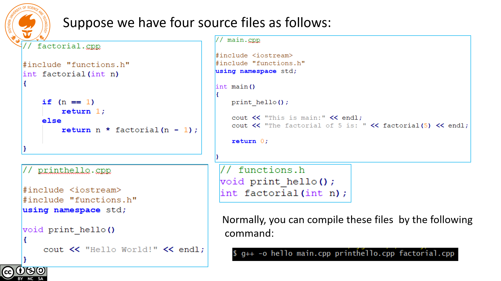
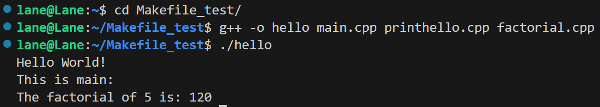
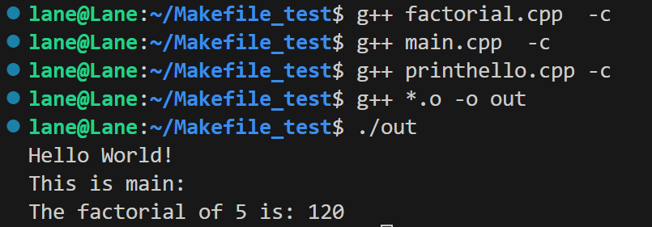

# 传统的编译方式

  - 编译全部文件并链接

    

    

  - 编译单个文件+链接

    - 如果我只对少数文件进行了修改，只需要编译少数文件，最后进行链接

    - 节省了其余大多数文件编译所用的时间

    

    - 编译单个文件 `g++ factorial.cpp -c`

    - 链接所有`.o`文件 `g++ *.o -o out` （规定生成的可执行文件叫out）

# Makefile

- Makefile是一个文件，放在与程序文件在同一目录下

- 注释以`#`开头

## version 1

  ```MakeFile
  hello: main.cpp printhello.cpp  factorial.cpp
  	g++ -o hello main.cpp printhello.cpp  factorial.cpp
  ```

  - 运行make的时候自动检查时间戳，若依赖文件中任意文件最后一次修改时间比目标文件晚，则运行command，反之不运行

  - 也就是说如果我只改了一个文件，它也会全部编译并链接

  - 其实就是把传统的编译方式写成了脚本，敲命令的时候只需要输入make，但没有减少不必要的编译时间

## version 2

  ```MakeFile
  CXX = g++
  TARGET = hello
  OBJ = main.o printhello.o factorial.o
  
  $(TARGET): $(OBJ)
  	$(CXX) -o $(TARGET) $(OBJ)
  
  main.o: main.cpp
  	$(CXX) -c main.cpp
  
  printhello.o: printhello.cpp
  	$(CXX) -c printhello.cpp
  
  factorial.o: factorial.cpp
  	$(CXX) -c factorial.cpp
  ```

  - 看上去比version 1复杂，实际上类似于 

  - 每次执行make命令，会检查每个文件是否比目标文件新，只编译并链接修改后的文件，减少不必要的编译耗时

## version 3

  ```MakeFile
  CXX = g++
  TARGET = hello
  OBJ = main.o printhello.o factorial.o
  
  $(TARGET): $(OBJ)
  	$(CXX) -o $@ $^     # $@=TARGET  $^=OBJ
  
  %.o: %.cpp              # %.o %.cpp 通配符
  	$(CXX)  -c $<       # $<=%.cpp（单个）
  
  .PHONY: clean           # 如果没有这行，当目录中存在clean同名文件，就会产生歧义
  clean:
  	rm -f *.o $(TARGET)
  ```

  - 相比于version 2，那三个依赖文件被抽象成了通配符，写Makefile文件更简单

  - 后面关于clean可不考虑

## version 4

  ```MakeFile
  CXX = g++
  TARGET = hello
  SRC = $(wildcard *.cpp)         # 当前目录下所有.cpp文件 
  OBJ = $(patsubst %.cpp, %.o, $(SRC)) # SRC中文件后缀由.cpp改成.o
  
  $(TARGET): $(OBJ)
  	$(CXX) -o $@ $^
  
  %.o: %.cpp
  	$(CXX) -c $<
  
  .PHONY: clean
  clean:
  	rm -f *.o $(TARGET)
  ```

  - 这个版本与version 3相比就是把上面OBJ文件的获取变成了先获得SRC，再改后缀两步

  - 无需手动输入依赖文件，只需放到当前目录下即可

# 参考

  BV188411L7d2


