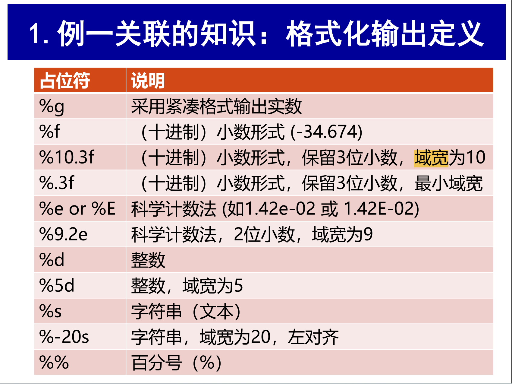
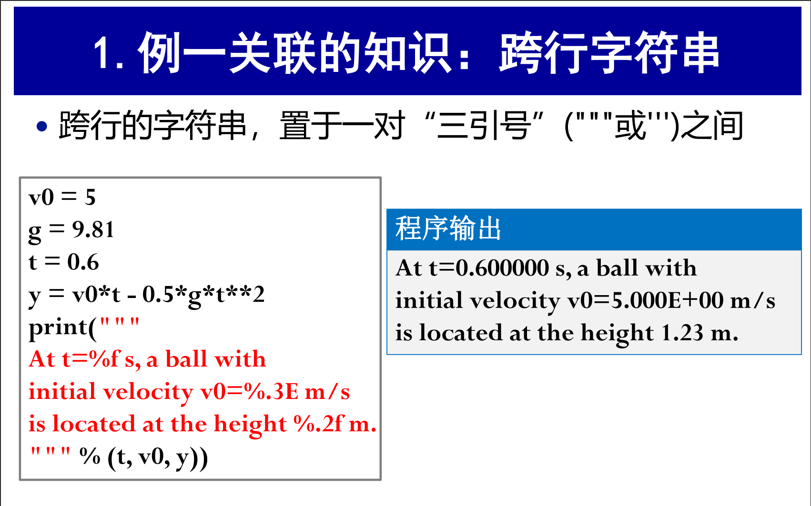
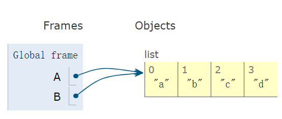
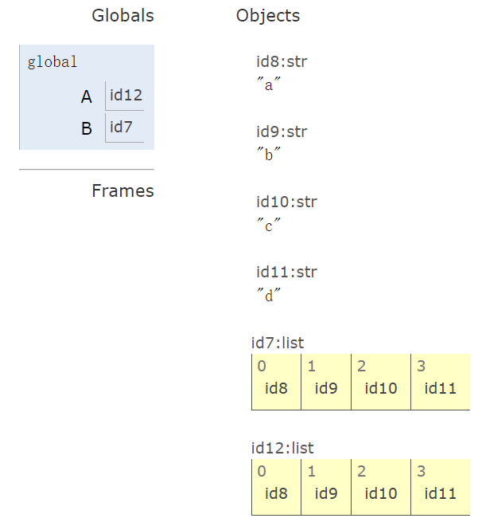
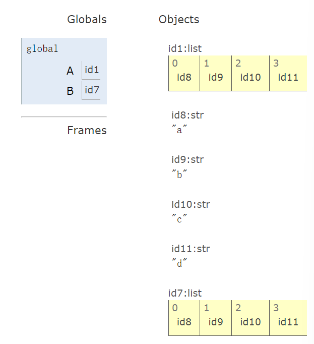
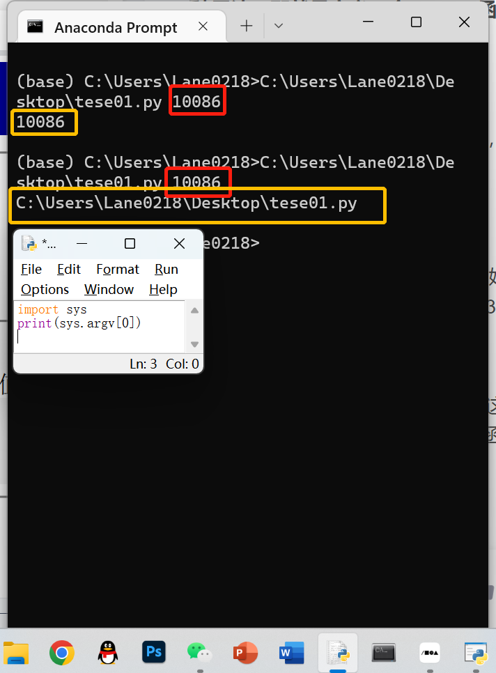
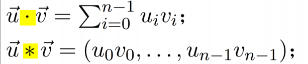

# Chap 01 公式计算

1.格式化输出定义



2.跨行字符串



3.四舍五入

```Python
c=3.934
d=round(c,1) # 1表示保留一位小数
e=round(c)   # 如果不写就表示四舍五入到整数
print(d)     # 3.9
print(e)     # 4
```

4.对于str类型的小数变量，如果需要转化为int类型变量，直接强制转换会报错，需要先转化为float，再转化为int

# Chap 02 循环和列表

1.

```Python
a.insert(k,e)  # 在a的位置k插入元素e（插入之后，e的下标是k）
a.index(4)     # 获取第一个元素4的下标
a.remove(4)    # 删除第一个4
del C[2]       # delete 3rd element
C=C+[40,45]    # extend C at the end
```

2.

```Python
somelist = ['book.tex', 'book.log', 'book.pdf'] 
texfile, logfile, pdf = somelist  # assign directly to variables

# 如果数量不匹配，就会报错
```

3.

```Python
# 方法一：使用下标进行循环遍历
for i in range(len(Cdegrees)):
    print(Cdegrees[i],Fdegrees[i])

# 方法二：使用zip
for C,F in zip(Cdegrees,Fdegrees):
    print(C,F)
```

4.

```Python
>>> A = [2, 3.5, 8, 10] 
>>> A[2:] # from index 2 to end of list 
[8, 10]
>>> A[1:3] # from index 1 up to, but not incl., index 3
[3.5, 8]
>>> A[:3] # from start up to, but not incl., index 3 
[2, 3.5, 8]
>>> A[1:-1] # from index 1 to next last element 
[3.5, 8]
>>> A[:] # the whole list (incl. index 0 and 3)
[2, 3.5, 8, 10]
```

5.

```Python
'''
关于列表A切片的一般形式为 A[start:end:step]
1.step的缺省值为1，且不允许为0
2.当step为正数时, start和end的缺省值分别是0 和n (长度)
3.当step为负数时, start和end的缺省值分别是-1和-(n+1)
'''
>>> A = [2, 3.5, 5, 10, 12]
>>> A[1:5:2]
[3.5, 10]
>>> A[::2] # equally, A[0::2]
[2, 5, 12]
>>> A[3::-1] # equally, A[3:-6:-1]
[10, 5, 3.5, 2]
>>> A[::-1] # reverse the list
[12, 10, 5, 3.5, 2]
```

6.浅拷贝、深拷贝、原地拷贝

  ```Python
  >>> A = [1, 2, 3, 4, 5]
  >>> B = ['a', 'b', 'c', 'd']
  >>> A = B
  >>> A[1] = 'x'
  >>> A
  ['a', 'x', 'c', 'd']
  >>> B
  ['a', 'x', 'c', 'd']
  ```

  

  执行完A=B语句后，两个列表均指向同一列表，此时无论对A还是B列表操作，两个列表的值都会同时改变（引用）

  ```Python
  >>> A = [1, 2, 3, 4, 5]
  >>> B = ['a', 'b', 'c', 'd']
  >>> A = B[:]
  >>> A[1] = 'x'
  >>> A
  ['a', 'x', 'c', 'd']
  >>> B
  ['a', 'b', 'c', 'd']
  ```

  

  ```Python
  >>> A = [1, 2, 3, 4, 5]
  >>> B = ['a', 'b', 'c', 'd']
  >>> A[:] = B   # equally, A[:] = B[:]
  >>> A
  ['a', 'b', 'c', 'd']
  >>> A[1] = 'x'
  >>> A
  ['a', 'x', 'c', 'd']
  >>> B
  ['a', 'b', 'c', 'd']
  ```

  

  深拷贝和原地拷贝的本质区别在于存储位置不同

# Chap 03 函数和分支

1.在函数内部修改全局变量需要先声明为 global

2.函数返回多个值

```Python
def yfunc(t, v0):
    g = 9.81
    y = v0*t - 0.5*g*t**2
    dydt = v0 - g*t
    return y, dydt

position, velocity = yfunc(0.6, 3)
print(position)
print(velocity)
# 0.034199999999999786
# -2.886

print(yfunc(0.6, 3))
#(0.034199999999999786, -2.886)
# 本质上是一个tuple
```

3.位置参数与关键字参数使用规则

（1）定义函数时

  • 关键字参数形如 <kw>=<value>，其中<kw>是参数名，<value>是该参数的缺省值

  • 在参数列表中，**关键字参数必须位于位置参数之后**

（2）调用函数时

  • 必须传入与函数定义时相同数目的位置参数，且其相对位置固定

  • 关键字参数可省略，当省略时，相当于传入了缺省值

4.舍入误差

  程序中当h < 10^-8时，结果反而出现严重偏差

    根本原因：浮点数的存储具有舍入（截断）误差，在计算过程中，又产生了误差传播
    
    h越小时，舍入同等大小的数所占比例越大。h很小的误差在计算中被放大了

  通常，h 值的选取需要根据具体情况进行调整，但一般建议的取值范围介于10^-2 和10^-6之间

5.**lambda表达式：更紧凑的函数定义形式（本质上是一个匿名函数）**

Importantly: lambda函数可以直接作为函数的参数传入（于是可以实现写出导数的定义）

```Python
f=lambda x:x**2-1
print(f(5))

# equally

def f(x):
  return x**2-1
print(f(5))
```

```Python
def diff2(f, x, h=1E-6):
  r = (f(x-h) - 2*f(x) + f(x+h))/h**2   #二阶导数的定义
  return r
def ff():
	return lambda x:x**3                #ff（x）=x**3
y = diff2(ff(),2)
print(y) 
```

# Chap 04 数据输入与异常处理

## 从终端输入

### 命令行参数

```Python
import sys
a=int(sys.argv[1])
print(a)

'''
运行时将文件拖入prompt中，会自动粘贴文件路径，空格后写入参数
命令行参数存放在sys.argv中（是一个list）
其中sys.argv[0]是文件的路径，[1]就是传入的第一个参数，如需传入多个参数，命令行参数使用空格分开，以此类推即可
'''

```



### eval与exec函数

#### eval（evaluation 计值）

  函数eval：将字符串当表达式计算（但计算完后对变量的值没有影响），不能计算语句（函数exec可以）

  ```Python
  i1 = eval(input('Give input: '))
  i2 = eval(input('Give input: '))
  r = i1 + i2
  print('%s + %s becomes %s\nwith value %s' % (type(i1), type(i2), type(r), r))
  ```

  ```Python
  formula = input('Write a formula involving x: ')
  def f(x):
      return ('%s' % eval(formula))
  ```

  ```Python
  def StringFunction(expr, vars='x'):
  	return eval("lambda"+vars+":"+expr)  #用引号将lambda和：转化为str，再用+将几个字符串拼接成一个大字符串'lambda vars:expr'，eval把引号去掉，即可return一个函数
  ```

#### exec（execution 执行）

  ```Python
  >>> exec("r=1+1")        #side effect：改变了r的值
  >>> r
  2
  ```

  ```Python
  formula = input('Write a formula involving x: ')
  code = """
  def f(x):
    return %s
    """ % formula
  exec(code)
  
  
  from math import *
  x = 0
  while x is not None: 
  	x = eval(input('Give x (None to quit): '))
  	if x is not None:
  		y = f(x)
  		print('f(%g)=%g' % (x, y))
  ```

## 从文件输入

```Python
# 一行一行地从文件中读取数据
infile=open('test.py','r')   # 默认只读；如果文件与代码在同一目录下，则输入文件名；否则输入文件绝对路径
for line in infile:
  # do something with line
infile.close()               # 一定要关闭文件（在处理完打开的文件后关闭文件以释放计算机资源，避免引发异常）


# 用readline()
infile=open('test.py','r') 
while True:
  line=infile.readline()            # 一次只读一行，以字符串形式存储
  if line=='':                      # 如果读到没有内容了
        break
  # do something with line
infile.close()


# 用readlines()整体读入
infile=open('test.py','r') 
lines=infile.readlines()            # 将文件的所有行读入到一个字符串的List中
infile.close()
for line in lines:
  # process line


# 用read()语句
text = infile.read()                # 将整个文件的内容读入到一个字符串中
infile.close()
s = text.split()                    # split将字符串分成一个个词，并存储到一个字符串list中
# process the string text


# 以上所有open语句可替换为with语句
with open('text.txt','r') as infile:# 自带close，不用担心忘记
```

```Python
outfile=open('test.py', 'w')        # 'w' for writing|'a' for appending
for data in datalist:
    outfile.write(data + '\n')      # write不会像print语句那样自带换行，需要自己加
outfile.close()

# 同理，open语句可替换为with语句
```

## 程序异常处理

```Python
import sys
try:
	C = float(sys.argv[1])
except IndexError:
	print('No command-line argument for C!')
	sys.exit(1)                                 # abort execution（中止执行）
except ValueError:
	print('C must be a pure number')
	sys.exit(1)
F = 9.0*C/5 + 32
print('%gC is %.1fF' % (C, F))
```

```Python
import sys
def read_C():
  try:
  	C = float(sys.argv[1])
  except IndexError:                            # raise后的语句无法执行
  	raise IndexError('Celsius degrees must be supplied on the command line')
  except ValueError:
  	raise ValueError('Degrees must be number, not "%s"' % sys.argv[1])
  if C < -273.15:
  	raise ValueError('C=%g is a non-physical value!' % C)
  return C

try:
	C = read_C()
except (IndexError, ValueError) as e:
    # print exception message and stop the program
    print(e)
    sys.exit(1)
```

```Python
#当try代码块中的程序运行没有异常时，程序将运行else代码块中的内容
a = int(input())
b = int(input())
try:
    answer = a/b
except:
    print("We can't divide by zero!")
else:
    print(answer)
```


# Chap 05 数组和曲线绘图

注：3-5已整理至[CSDN](https://blog.csdn.net/Lane0218/article/details/128698718?spm=1001.2014.3001.5502)

1. linspace采样构造数组

  ```Python
  import numpy as np
  def f(x):
  	return x**3
  n = 5 # number of points
  x = np.linspace(0, 1, n) # n points in [0, 1]
  
  #方法一
  y = np.zeros(n) # n zeros (float data type)  a=np.zeros([3,4])，3行4列
  for i in range(n):
  	y[i] = f(x[i])
  
  #方法二
  y=f(x) # 操作一个元素的函数也可以操作整个数组（array），注意math中的函数要用numpy中的函数替代
  ```

1. 向量计算

  

1. 基础绘图

  ```Python
  import matplotlib.pyplot as plt
  plt.plot(x,y)
  ```

1. 让图片更丰富

  ```Python
  # 标记x,y轴
  plt.xlabel('x') 				# label on the x axis
  plt.ylabel('y') 				# label on the y axix
  
  # 图像范围
  plt.axis([0, 3, -0.05, 0.6]) 	#[xmin, xmax, ymin, ymax]
  
  # 图像标题
  plt.title('My First Demo')
  
  # 图例
  plt.plot(t, y, 'b--',label='$t^2*exp(-t^2)$')	#两个$用于转义，幂用^表示
  plt.legend()           			#这一行不可缺少
  
  # 在一张图里绘制多条曲线（可以一条一条绘制，也可以同时绘制多条）
  plt.plot(x, y1,'b-',x, y2,'ro')
  
  # 多子图绘制
  plt.subplot(121)  				#一行两列，现在绘制第一张图
  plt.plot(t,Y1,'r')
  plt.xticks(t,labels)
  
  plt.subplot(122)				#一行两列，现在绘制第二张图
  plt.plot(t,Y2,'b')
  plt.xticks(t,labels)
  
  # 设置画布大小
  plt.figure(figsize=[8,5]) 		#在绘图之前设置画布大小，宽为 8 英尺，高为 5 英尺
  
  # 设置坐标轴刻度
  x=[2015,2014,2013,2012,2011,2010,2009,2008,2007,2006,2005,2004,2003,2002,2001,2000]
  plt.xticks(x,rotation=45)		#旋转45度，y轴刻度同理
  
  # 设置线的类型
  见下表
  ```

  |颜色（color）|线型（linestyle）|点型（marker）|标记大小（markersize）|透明度（alpha）|
|-|-|-|-|-|
|蓝色 b|实线 -|圆形 o|markersize=10|alpha=0.5|
|绿色 g|虚线 --|方形 s|||
|红色 r|虚点线 -.|加号 +|||
|黄色 y|点线 :|叉形 x|||
|黑色 k|点 .||||
|白色 w|||||
|蓝绿（墨绿） c（cyan）|||||
|红紫（洋红） m（magenta）|||||
|RGB表示法 #2F4F4F|||||

1. 画不连续的函数

  ```Python
  def H(x):
  	return (0 if x < 0 else 1)
  # 对于上述函数，如果x是数组，则会报错
  
  # 补救方法一 多写一个函数
  def H_lppo(x):
    r=x.copy()
    for i in range(len(x)):
      r[i]=H(x[i])
    return r
  y=H_loop(x)
  
  # 补救方法二 用where
  def Hv(x):
    return np.where(x<0,0.0,1.0)
  ```

  ```Python
  #接收一个参数，返回符合条件的下标
  a=np.array([1,2,3,4,5])
  idx=np.where(a>2)		# idx=array([2,3,4])
  b=a[idx]				# b=array([3,4,5])
  
  #接收三个参数，用于三目运算
  y=np.array([1,2,3,4,5])  
  y=np.where(y%2==0,y+1,y-1)# 将奇数转换为偶数，偶数转换为奇数(如果是偶数，则返回+1后的值，反之-1)
  ```

1. 数组拷贝

  因为数组设计出来就是用于处理大规模数据的，所以如果用a=x这样的方式，实际只是在对数组做引用：a=x;a[-1]=1000，则x[-1]=1000

  避免修改可以使用拷贝：a = x.copy()

  ```Python
  a = x[r:] 			# a refers to a part of the x array
  a[-1] = 1000 		# changes x[-1]
  a = x[r:].copy()
  a[-1] = 1000 		# does not change x[-1]
  ```

1. 获取二维数组的切片

  ```Python
  # 对每一维分别使用start:stop:inc
  >>> t = np.linspace(1, 30, 30).reshape(5, 6)
  >>> t
  array([[ 1., 2., 3., 4., 5., 6.],
  		[ 7., 8., 9., 10., 11., 12.],
  		[ 13., 14., 15., 16., 17., 18.],
  		[ 19., 20., 21., 22., 23., 24.],
  		[ 25., 26., 27., 28., 29., 30.]])
  >>> t[1:-1:2, 2:]
  array([[ 9., 10., 11., 12.],
  		[ 21., 22., 23., 24.]])
  ```

# Chap 06 字典和字符串

1. 对字典的遍历返回值是keys

  ```Python
  temps={'wh':34.3,'cs':26.7,'gz':32.5}
  for a in temps():
      print(a)
  
  '''
  wh
  cs
  gz
  '''
  
  #如果需要遍历value，可用
  for a in temps.values():
    
  #如果需要遍历key，也可用
  for a in temps.keys():
  ```

