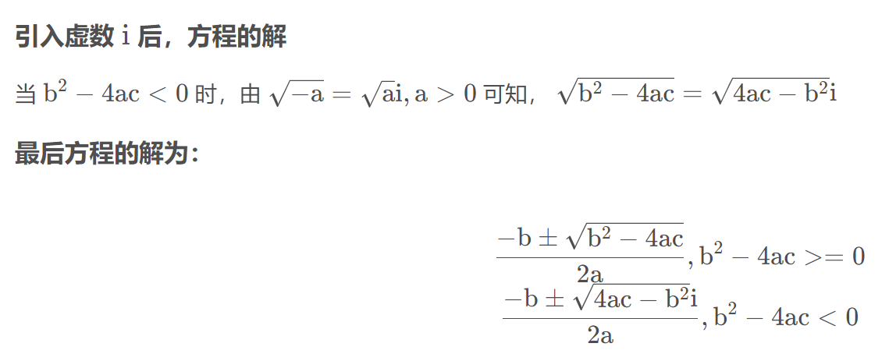
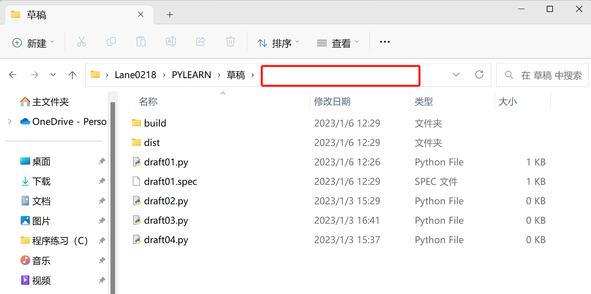
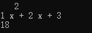

# ERROR

1. 定义函数时忘记return值

2. sum函数是对列表求和，不能对函数结果求和：

  ```Python
  def A(X):
    a=x+10086
    return a 
  for i in range(1,n+1):
    sum(A(i)) #错误
  ```

  如果非要这么使用，应该如下：

  ```Python
  i=0
  L=[]
  def A(x):
      a=x+10086
      return a
  for i in range(1,2):
      L.append(A(i))
  print(sum(L))
  
  ```

1. 函数名称不能与变量名称相同

2. IndentationError: unindent does not match any outer indentation level（‘未缩进与任何外部缩进级别不匹配’，用tab重新调整一下缩进）

3. 注意，如果使用/，得到的一定是float类型变量，会导致无法遍历，必要时可用//或强制类型转化

4. print函数自带换行功能，所以要换行只需要print()，括号中不用加‘\n’

5. EOL ：end of line.

6. 注意有的时候需要在每次循环开始前对布尔或其他变量进行初始化。比如用于判断一次循环是否符合题意的布尔变量，一旦被改为False就失去判断作用了

# NOTEBOOK

1. 

  ```Python
  import math
  
  # 将弧度制转化为角度制（2π等于360°，输出结果为浮点数）
  print("2π Radians in Degrees : ",math.degrees(2*math.pi))
  
  # 将角度制转化为弧度制（180°等于3.14···，输出结果为浮点数）
  print("180 degrees in radian : ",math.radians(180))
  ```

2. 

  ```Python
  #同行输出
  print('1,2,3' , end='')
  print('4,5')
  # 1,2,34,5
  
  #使用分隔符
  print(1,2,3,sep=',',end='.\n')
  #1,2,3.
  
  ```

3. 闭包

   1. 闭包作用：保证数据安全


   2. 内层函数对外层函数非全局变量的引用就会形成闭包


   3. 被引用的非全局变量也称自由变量，这个自由变量会与内层函数产生一个绑定关系


   4. 自由变量不会在内存中消失

比如计算近三天比特币平均收盘价（6000，7000，8000）：

```Python
# 不使用闭包
'''
每次调用函数都会对全局变量L产生修改，但L=[]这一行放在外面，容易被修改，不够安全
tips：对于string,int,tuple，在函数中如需修改需要先global声明，而列表属于可变数据类型，不用声明
'''
L=[]
def average(value):
  L.append(value)
  return sum(L)/len(L)
print(average(6000))
print(average(7000))
print(average(8000))


# 使用闭包
'''
将列表放在外层函数内，然后定义一个内层函数，将值传入内层函数，内层函数返回具体值，外层函数返回内层函数
'''
def average():
  L=[]
  def inner(value):
    L.append(value)
    return sum(L)/len(L)
  return inner

avg=average()
print(avg(6000))
print(avg(7000))
print(avg(8000))

```


1. 一元二次方程虚根求解

 

1. IDLE中特殊变量“_”

  表示上一次运算结果

1. 如果要想直接双击运行源代码，需在文件末尾加一行input（）用于等待用户输入，用户按enter后，程序结束运行并关闭窗口，否则程序运行后会自动关闭Windows命令提示符窗口，从而无法观察到程序运行结果

2. python中整除运算和取模运算（包含负数）

  （1）整除运算  a/b=c 则 a//b=[c]

  （2）取模运算 余数=被除数-除数×商（整除后的）

1.  

  ```Python
  print(bin(37))          #bin(n)是将十进制整数n转换为二进制
  print(oct(37))          #oct(n)是将十进制整数n转换为八进制
  print(hex(37))          #bin(n)是将十进制整数n转换为十六进制
  
  print(int('100101', 2)) #int(n, 2)是将二进制数n转化为十进制
  print(int('45', 8))     #int(n, 8)是将八进制数n转化为十进制
  print(int('25', 16))    #int(n, 16)是将十六进制数n转化为十进制
  ```

1. 

  ```Python
  def  zero(s):
      a = int(s)
      assert a > 0,"a超出范围"   #这句的意思：如果a确实大于0，程序正常往下运行
      return a
  
  zero("-2")  #但是如果a是小于0的，程序会抛出AssertionError错误，报错为参数内容“a超出范围”
  
  '''
  Traceback (most recent call last):
    File "e:\Python_list\class_student\temp.py", line 6, in <module>
      zero("-2")
    File "e:\Python_list\class_student\temp.py", line 3, in zero
      assert a > 0,"a超出范围"
  AssertionError: a超出范围
  '''
  ```

1. 

  ```Python
  #在prompt命令行内
  
  #安装最新版本（以numpy为例）
  pip install numpy
  
  #更新至最新版本（以numpy为例）
  pip install --upgrade numpy
  ```

1. 使用pyinstaller打包程序成为exe文件

  在文件末尾记得添加`print(input())`防止文件打开后闪退

  进入文件目录，点击红框区域，输入cmd

  

  在弹出的命令行中输入`pyinstaller -F draft01.py`回车

  待打包完成后在dist文件夹中即可找到exe文件

1. 

  ```Python
  from itertools import combinations
  L1=[]
  for i in combinations(range(5),3):      #在0-4这5个数里面，每次选取3个数
      L1.append(list(i))
  print(L1)   
  
  '''
  [[0, 1, 2], [0, 1, 3], [0, 1, 4], [0, 2, 3], [0, 2, 4], [0, 3, 4], [1, 2, 3], [1, 2, 4], [1, 3, 4], [2, 3, 4]]
  '''
  ```

1. 当多个for、while循环彼此嵌套时，break、continue语句只能跳出最近的一层循环

  for、while语句可以附带一个else子句，如果for、while语句没有被break语句中止，则会执行else子句，否则不执行

1. 非局部变量nonlocal

  在函数体中可以定义嵌套函数，在嵌套函数中，如果要为定义在上级函数体的局部变量赋值，可以使用nonlocal语句表明变量不是所在块的局部变量，而是在上级函数体中定义的局部变量

  ```Python
  def outer_func():
      a=10086
      print('outer_a=%d'%a)
      def inner_func():           #定义嵌套函数
          nonlocal a              #声明a为在上级函数体中定义的局部变量
          a=114514                #对a重新赋值
          print('inner_a=%d'%a)
      inner_func()                #执行内部函数后，a的值被改变
      print('outer_a=%d'%a)
  outer_func()
  
  '''
  outer_a=10086
  inner_a=114514
  outer_a=114514
  '''
  ```

1. map()函数用法

  map(f,iterable,···)，将函数f应用于可迭代对象，返回结果为可迭代对象

  ```Python
  #例一
  def is_odd(x):
    return x%2==1         # 返回bool类型
  print(list(map(is_odd,range(1,6))))
  # [True, False, True, False, True]
  
  ······
  #例二
  print(list(map(abs,[1,-3,6,-9,0,-11])))
  #[1, 3, 6, 9, 0, 11]
  
  ······
  #例三
  print(list(map(str,[1,-3,6,-9,0,-11])))
  #['1', '-3', '6', '-9', '0', '-11']
  
  ······
  #例四
  def greater(x,y):
      return x>y
  print(list(map(greater,[1,3,5,-1,0],[2,0,1,3,0])))
  #[False, True, True, False, False]
  ```

1. filter()函数用法

  filter(f,iterable,···)，将函数f应用于可迭代对象的每个元素，若f返回值为True则保留，False、None则删除，返回结果为筛选过后的可迭代对象

  ```Python
  #例一
  def is_odd(x):
    return x%2==1         # 返回bool类型
  print(list(filter(is_odd,range(1,6))))
  #[1, 3, 5]
  
  ···
  #例二（返回三位数的回文数的可迭代对象）
  def is_palindrome(x):
      if str(x)==str(x)[::-1]:
          return x
  print(list(filter(is_palindrome,range(100,1000))))
  #[101, 111, 121, 131, 141, 151, 161, 171, 181, 191, 202, 212, 222, 232, 242, 252, 262, 272, 282, 292, 303, 313, 323, 333, 343, 353, 363, 373, 383, 393, 404, 414, 424, 434, 444, 454, 464, 474, 484, 494, 505, 515, 525, 535, 545, 555, 565, 575, 585, 595, 606, 616, 626, 636, 646, 656, 666, 676, 686, 696, 707, 717, 727, 737, 747, 757, 767, 777, 787, 797, 808, 818, 828, 838, 848, 858, 868, 878, 888, 898, 909, 919, 929, 939, 949, 959, 969, 979, 989, 999]
  ```

1. 可变参数

  在声明函数时，通过带星的参数，（例如*param1），允许向函数传递可变数量的实参。调用函数时，从那一点后所有的参数被收集为一个**元组**。

  在声明函数时，也可以通过带双星的参数（例如**param2），允许向函数传递可变数量的实参（调用时必须以key=value的字典形式）。调用函数时，从那一点后所有的参数被收集为一个**字典**。

  ```Python
  #单星
  def my_sum(a,b,*c):
      s=a+b
      for n in c:
          s+=n
      return s
  print(my_sum(1,2))          #3
  print(my_sum(1,2,3))        #6
  print(my_sum(1,2,3,10086))  #10092
  
  #双星
  def my(a,b,**d):
      tot=a+b
      for key in d:
          tot+=d[key]
      return tot
  print(my(1,2,male=3,female=4))  #d的输入一定是以key=value的字符形式
  ```

1. 一些有用的数组操作

  ```Python
  a=np.zeros_like(x)		#生成和数组x结构相同的零数组
  a=np.zeros(x.shape,x.dtype)	#结构和数据类型都与x相同，与上一行等价
  
  a[[1,6,7]]=10				#把数组a下标为1，6，7的值改成10
  n=a.size					#a中所有元素的个数
  
  
  ```

1. array和asarray操作
相同点：array和asarray都能将结构数据转换成ndarray数组。
不同点：
（1）当他们的参数是列表型数据(list)时，二者没有区别；
（2）当他们的参数是数组类型(array)时，np.array()会返回参数数组的一个副本(copy,两者值一样但指向不同的内存),np.asarray()会返回参数数组的一个视图(两者指向同一块内存，就相当于直接引用)。
优缺点：
（1）np.array()的副本会新开辟一块内存，对于大数组来说，会存在大量的复制操作，速度更慢且不节约内存；
（2）np.asarray()的视图相当于新增加了一个指向当前内存的引用，不存在复制操作，速度更快且节约内存。但是注意通过其中的一个引用修改数据，其他引用的数据也会跟着变，因为他们指向同一块内存区域。

2. isinstance的用法

  ```Python
  isinstance(x,(float,int))	# 判断x类型是不是float或int之一，返回bool
  
  
  ```

1. np.ndenumerate的用法

  ```Python
  Z = np.arange(9).reshape(3,3)
  for index, value in np.ndenumerate(Z):
      print(index, value)
  
  '''
  (0, 0) 0
  (0, 1) 1
  (0, 2) 2
  (1, 0) 3
  (1, 1) 4
  (1, 2) 5
  (2, 0) 6
  (2, 1) 7
  (2, 2) 8
  '''
  ```

1. numpy.polyfit的用法

  `numpy.polyfit(x,y,deg)`就是一个用来拟合多项式数据的函数。

  关于`numpy.polyfit(x,y,deg)`函数，其中：

  - 第一个是自变量`x`，也就相当于`x`轴上的数据点；

  - 第二个是因变量`y`，也就相当于之前`x`轴上的数据点在某个函数上的值；

  - 第三个是度数`deg`，表示需要用最高次数为`deg`的多项式来拟合输入的数据

  最后，返回值是一个长度为`deg+1`的`numpy.array`数据`p`，从`p`数组的`0`号位到`deg`号位，依次表示某多项式方程从高次到低次的系数，即表示的函数是`p[0] * x^deg + p[1] * x^(deg-1) + ... + p[deg-1] * x + p[deg]`。

1. numpy.poly1d的用法

  通过`numpy.polyfit`，我们能够找到一个尽可能拟合所有数据点的多项式函数`f`。

  `numpy`还提供了一个功能`poly1d`，它以`polyfit`等函数计算出的系数列表或元组作为参数，然后返回一个可以被求值的多项式 Python 函数。

  ```Python
  import numpy as np
  
  #使用numpy.poly1d来存储多项式x^2 + 2 * x + 3
  f = np.poly1d([1, 2, 3])
  
  #使用numpy.ploy1d的格式输出多项式
  print(f)
  
  #计算多项式3^2 + 2*3 + 3的值
  print(f(3))
  ```

  示例输出：

  

  前两行输出的是多项式：`1*x^2 + 2*x + 3`，最后一行是`x=3`时，`1*3^2 + 2*3 + 3`的结果。

1. 时间函数的用法

  ```Python
  import datetime
  begin = '18/08/01'
  end = '2019/01/31'
  
  # 将字符串开始日期 转成 日期格式   注意 : 格式一定要对应 
  begin_date = datetime.datetime.strptime(begin, '%y/%m/%d')  #y指两位年份，自动识别（≥69识别为20世纪，＜69识别为21世纪）
  print("开始:", begin_date)
  end_date = datetime.datetime.strptime(end, '%Y/%m/%d')      #Y指四位年份
  print("结束:", end_date)
   
  # 从开始到结束之间有多少个月
  month = (end_date.year - begin_date.year)*12 + (end_date.month - begin_date.month)
  print(month)
  
  '''
  开始: 2018-08-01 00:00:00
  结束: 2019-01-31 00:00:00
  5
  '''
  ```

