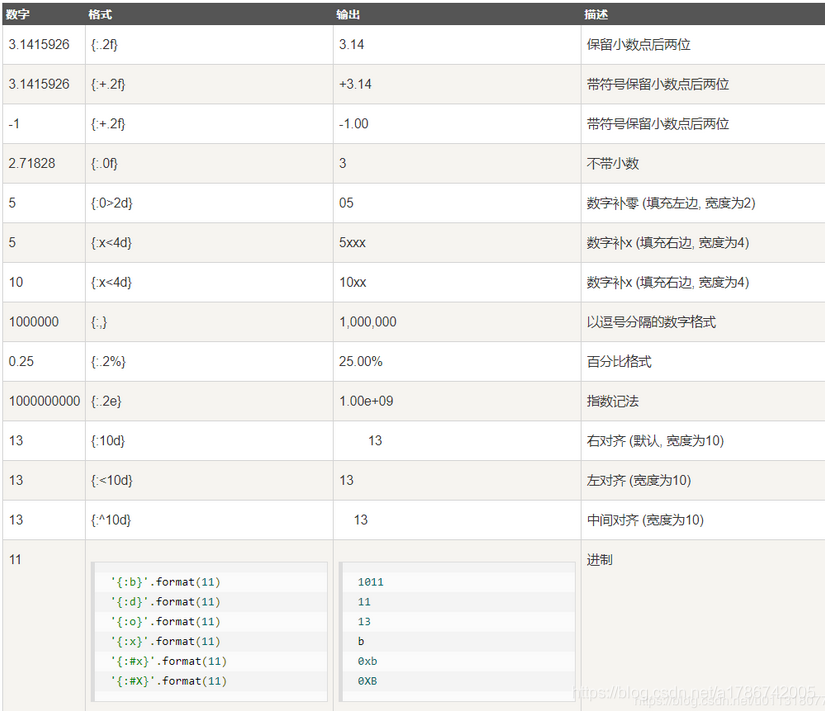

# 一、位置参数

## 1.1 不设置位置参数

不设置指定位置的话，按照默认顺序

```Python
print("{}的性别是：{}".format("小明","男"))

# 小明的性别是：男
```

## 1.2 设置指定位置

设置了指定位置后，会按照指定位置传入

```Python
print("{0} {1}".format("Hello","World"))
print("{1} {0}".format("Hello","World"))
print("{0} {1} {0}".format("Hello","World"))
print("{1} {1} {0}".format("Hello","World"))

'''
Hello World
World Hello
Hello World Hello
World World Hello
'''
```

## 1.3 通过序列传入

在序列名前加一个*，就可以传入。

```Python
list1 = ["Hello","World"]
print("{} {}".format(*list1))   # 按照默认位置传入
print("{0} {1}".format(*list1))   # 按照指定位置传入
print("{1} {0}".format(*list1))   # 按照指定位置传入

'''
Hello World
Hello World
World Hello
'''
```

# 二、关键字参数

## 2.1 直接传入

```Python
print("{name}的身高是{height}".format(name="小明",height="180cm"))

# 小明的身高是180cm
```

## 2.2 通过字典传入

在字典前加两个*，就可以传入

```Python
kw = {"name":"小明","height":"180cm"}
print("{name}的身高是{height}".format(**kw))

# 小明的身高是180cm
```

# 三、格式化数字

我们先看一下常用的格式化字符串的方法：

```Python
grade = 97.556   # 浮点数取位数
print("我的成绩为：{:.2f}分".format(grade))

# 我的成绩为：97.56分
```



‘+’ 表示在正数前显示 +，负数前显示 -； （空格）表示在正数前加空格

b、d、o、x 分别是二进制、十进制、八进制、十六进制

保留小数点后几位，会自动四舍五入，这与%占位符不同

第十行科学计数法表示1.00*10^9，其中指数如果为一位数则补齐为两位，如09

# 四、自身转义

此外我们可以使用大括号 {} 来转义大括号，如下实例：

```Python
print ("{}{{0}}".format("Hello"))

Hello{0}
```


