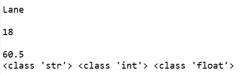

# eval()函数

如果需要读入一个字符串，直接调用input()就可以解决，而当我们要读入整数或者浮点数的时候，可以利用int(input())或者float(input())进行处理，也可以直接用eval(input())处理。
eval(<字符串>)能够以Python表达式的方式解析并执行字符串，并将返回结果输出。eval()函数将去掉字符串的两个引号，并将其解释为一个变量。

```Python
name=input()
age=eval(input())
weight=eval(input())

print(type(name),type(age),type(weight))
```



# 常见输入格式处理方式

## 输入一个列表

使用上面讲的eval(input())组合就可以解决。

```Python
mylist=eval(input())
print('mylist的类型是：',type(mylist))
print('mylist',mylist)

'''
[1,2,3,4,10086]
mylist的类型是： <class 'list'>
mylist [1, 2, 3, 4, 10086]
'''
```

## 空格分隔的多项输入

  ### 获取以空格分隔的字符串

  使用input().split()，可以得到由这些字符串组成的**列表**。

  ```Python
  names=input().split()
  print(type(names))
  print(names)
  
  '''
  'Lane' 'Jack' 'Tom'
  <class 'list'>
  ["'Lane'", "'Jack'", "'Tom'"]
  '''
  ```

  ### 获取以空格分隔的数字

  先用上面类似于字符串的处理方式，然后再用map转换成相应的类型，注意得到的不再是列表。

  ```Python
  age1,age2,age3=map(int,input().split())
  print(age1,age2,age3)
  
  age=list(map(int,input().split())) # 这样才能得到列表
  ```

## 逗号分隔的多项输入

与空格类似，在split（）中传入参数‘,’    即可：split（','）

